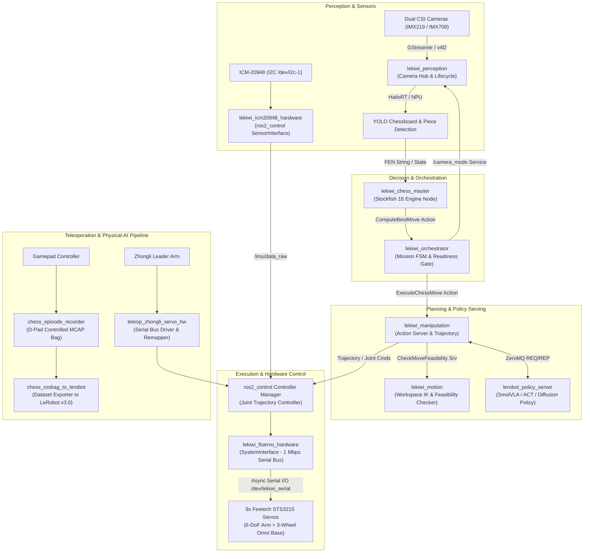

# LeKiwi ROS 2 Workspace

[](https://docs.ros.org/)
[](https://en.cppreference.com/)
[](https://www.python.org/)
[](https://hailo.ai/)
[](https://github.com/huggingface/lerobot)
[](LICENSE)

Production ROS 2 workspace for the **LeKiwi Robot**: an autonomous mobile manipulation platform featuring an omnidirectional 3-wheel base, a 6-DoF robotic arm, stereo perception with Hailo-8/8L NPU acceleration, autonomous chess game playing with Stockfish FSM integration, native LeRobot imitation learning policy serving via ZeroMQ, and high-performance `ros2_control` hardware abstraction.

---

## 🏛️ System Architecture

The following diagram illustrates the complete runtime architecture, from sensor ingestion and Hailo NPU inference to Stockfish decision-making, motion feasibility verification, LeRobot policy execution, and low-level motor actuation.



---

## 📦 Active Packages Catalog

The workspace consists of 15 active packages organized by operational domain:

### 1. Core Orchestration & Game Decision

| Package | Language / Type | Description |
| :--- | :---: | :--- |
| [`lekiwi_orchestrator`](lekiwi_orchestrator/) | Python / `rclpy` | High-level autonomous chess mission orchestrator FSM, readiness-gated navigation startup, and dynamic camera mode switching. |
| [`lekiwi_chess_master`](lekiwi_chess_master/) | C++ | Chess game state tracking, FEN string generation, and Stockfish action server implementing `ComputeBestMove.action`. |

### 2. Motion Planning & Physical-AI Policy Serving

| Package | Language / Type | Description |
| :--- | :---: | :--- |
| [`lekiwi_manipulation`](lekiwi_manipulation/) | Python / `rclpy` | Cartesian trajectory planning, pick-and-place execution, `ExecuteChessMove.action` server, and ZeroMQ policy client bridge. |
| [`lekiwi_motion`](lekiwi_motion/) | C++ | Kinematics feasibility checker, workspace reachability validation, system readiness gating, and torque management state. |
| [`lerobot_policy_server`](lerobot_policy_server/) | Python / ZeroMQ | High-throughput ZeroMQ inference server bridging LeRobot physical-AI policies (ACT, Diffusion, SmolVLA) with ROS 2. |

### 3. Perception & Sensor Hub

| Package | Language / Type | Description |
| :--- | :---: | :--- |
| [`lekiwi_perception`](lekiwi_perception/) | C++ Components | Lifecycle-managed dual CSI camera hub, dynamic GStreamer valve control, Hailo-8/8L NPU YOLO inference, and chessboard detection. |

### 4. Hardware Abstraction & Teleoperation

| Package | Language / Type | Description |
| :--- | :---: | :--- |
| [`lekiwi_ftservo_hardware`](lekiwi_ftservo_hardware/) | C++ `ros2_control` | `SystemInterface` hardware plugin for 9 Feetech STS3215 servos over a 1 Mbps serial bus with dedicated asynchronous I/O thread. |
| [`lekiwi_icm20948_hardware`](lekiwi_icm20948_hardware/) | C++ `ros2_control` | `SensorInterface` hardware plugin for ICM-20948 9-DoF IMU communicating over hardware I2C (`/dev/i2c-1`). |
| [`teleop_zhongli_servo_hw`](teleop_zhongli_servo_hw/) | C++ Driver | Dedicated protocol driver, calibration CLI, and joint publisher for Zhongli / uArm leader teleoperation arms. |

### 5. System Composition, Kinematics & Interfaces

| Package | Language / Type | Description |
| :--- | :---: | :--- |
| [`lekiwi_interfaces`](lekiwi_interfaces/) | Custom IDL | Custom ROS 2 Actions (`ComputeBestMove`, `ExecuteChessMove`), Services (`SetCamMode`, `CheckMoveFeasibility`), and Messages. |
| [`lekiwi_description`](lekiwi_description/) | URDF / Xacro | Kinematic robot description, CAD STL meshes, joint limits, transmissions, and `ros2_control` hardware tags. |
| [`lekiwi_bringup`](lekiwi_bringup/) | Launch & Config | Master launch compositions (`robot.launch.py`), controller parameters, udev rules, and diagnostic monitors. |

### 6. Calibration & Physical-AI Dataset Pipeline

| Package | Language / Type | Description |
| :--- | :---: | :--- |
| [`lekiwi_calibration`](lekiwi_calibration/) | Python / OpenCV | Unified calibration suite: Chessboard AprilTag bundle adjustment, Hand-Eye calibration, and Omni Base kinematics tuning. |
| [`chess_episode_recorder`](chess_episode_recorder/) | C++ / ROS 2 | Real-time episode recorder for LeKiwi Chess Physical-AI with Gamepad D-Pad workflow and lossless MCAP storage. |
| [`chess_rosbag_to_lerobot`](chess_rosbag_to_lerobot/) | Python / LeRobot | Converter pipeline transforming LeKiwi MCAP rosbags into standard HuggingFace LeRobot v3.0 dataset formats. |

---

## 📡 ROS 2 Communication Contracts

### Custom Actions

| Action | Providing Package | Description |
| :--- | :--- | :--- |
| `lekiwi_interfaces/action/ComputeBestMove` | `lekiwi_chess_master` | Requests Stockfish chess engine to analyze current FEN and compute optimal UCI move (e.g. `e2e4`). |
| `lekiwi_interfaces/action/ExecuteChessMove` | `lekiwi_manipulation` | Executes physical pick-and-place chess move across target squares with Cartesian trajectory or policy rollout. |

### Custom Services

| Service | Providing Package | Description |
| :--- | :--- | :--- |
| `lekiwi_interfaces/srv/SetCamMode` | `lekiwi_perception` | Dynamically switches camera pipeline modes (e.g. Head/Chessboard vs. Wrist/Obstacle). |
| `lekiwi_interfaces/srv/CheckMoveFeasibility` | `lekiwi_motion` | Verifies workspace reachability, collision clearances, and inverse kinematics before execution. |
| `lekiwi_interfaces/srv/SetTorqueEnabled` | `lekiwi_motion` | Enables or disables servo bus torque for lead-through teaching or compliance. |
| `lekiwi_interfaces/srv/ResetMotorBus` | `lekiwi_ftservo_hardware` | Clears serial hardware faults and re-initializes Feetech STS communication. |

---

## 🔌 Hardware Setup & Device Mappings

Ensure dedicated udev rules are installed to grant non-root permissions and create stable persistent device symlinks:

```bash
sudo cp lekiwi_bringup/udev/99-lekiwi.rules /etc/udev/rules.d/
sudo cp teleop_zhongli_servo_hw/udev/99-teleop-lekiwi.rules /etc/udev/rules.d/
sudo udevadm control --reload-rules && sudo udevadm trigger
```

### Port & Bus Assignments

| Device Symlink | Interface | Baudrate / Address | Target Subsystem |
| :--- | :---: | :---: | :--- |
| `/dev/lekiwi_serial` | USB-to-UART Serial | 1,000,000 baud | 9x Feetech STS3215 Servos (Arm + Omni Base) |
| `/dev/uarm_leader` | USB-to-UART Serial | 115,200 baud | Zhongli Teleoperation Leader Arm |
| `/dev/i2c-1` | Hardware I2C | Address `0x68` | ICM-20948 9-DoF IMU Sensor |
| `/dev/gamepad` | USB HID | Event Device | Teleop Joystick & Episode Recording Controller |

---

## 🚀 Quick Start Guide

### 1. Build the Workspace

```bash
# Clean build with symlink install
colcon build --symlink-install

# Or selectively build core subsystems
colcon build --packages-up-to lekiwi_bringup lekiwi_orchestrator lerobot_policy_server
source install/setup.bash
```

### 2. Run Test Suites

```bash
# Execute unit tests across all active packages
colcon test --event-handlers console_direct+
colcon test-result --verbose
```

### 3. Launching the System

#### A. Full Stack Simulation & Mock Mode (Safe, no physical hardware needed)
```bash
# Launches complete robot stack with simulated motor bus and mock camera streams
ros2 launch lekiwi_bringup robot.launch.py hardware_type:=mock
```

#### B. Full Autonomous Stack on Physical Robot
```bash
# Launches real hardware interfaces, Hailo-8 NPU inference, and orchestrator FSM
ros2 launch lekiwi_bringup robot.launch.py \
  hardware_type:=real \
  manipulation:=kinematics \
  chess_master:=true \
  cameras:=true
```

#### C. Subsystem-Level Isolated Execution
```bash
# Launch only the perception pipeline (Cameras + Hailo NPU)
ros2 launch lekiwi_bringup cameras.launch.py

# Launch Stockfish chess engine action server
ros2 launch lekiwi_bringup chess_master.launch.py

# Launch Autonomous Mission Orchestrator
ros2 launch lekiwi_bringup orchestrator.launch.py

# Launch LeRobot ZeroMQ Policy Server
ros2 run lerobot_policy_server server --config src/lerobot_policy_server/config/policy_config.yaml

# Launch Unified Calibration Suite
ros2 launch lekiwi_calibration calibrate_handeye.launch.py
```

---

## 🗄️ Archived & Deprecated Packages

Legacy components located in [`deprecated/`](deprecated/) are retained for historical reference and isolated from build routines via `COLCON_IGNORE`:
- `apriltag_localizer` & `handeye_calibration`: Migrated to the unified [`lekiwi_calibration`](lekiwi_calibration/) suite.
- `lekiwi_moveit_config`: Replaced by the native Cartesian & LeRobot trajectory pipeline in [`lekiwi_manipulation`](lekiwi_manipulation/).
- Legacy `lekiwi_orchestrator`: Refactored and modernized in root [`lekiwi_orchestrator`](lekiwi_orchestrator/).
