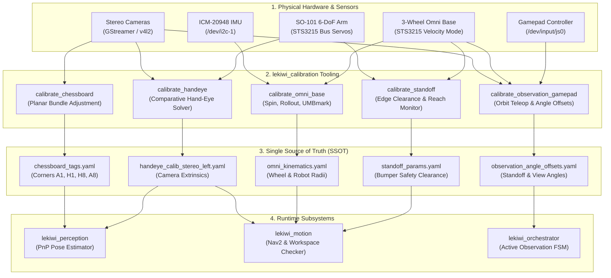

## Overview

The `lekiwi_calibration` package provides a unified offline and interactive
calibration suite for the LeKiwi Autonomous Chess Playing Robot. It consolidates
five essential robotics calibration domains into a single, standardized ROS 2
package (`ament_python`):

1. **Chessboard AprilTag Bundle Adjustment**: Non-linear planar bundle adjustment
   optimizing the 2D layout and yaw heading of the four outer fiducial AprilTags.
2. **Camera-to-Robot Hand-Eye Extrinsics**: OpenCV native GUI tool estimating
   homogeneous transforms ($AX = XB$ / $AX = ZB$) for Eye-to-Hand and Eye-in-Hand.
3. **Omnidirectional Base Kinematics**: Systematic tuning of wheel radius,
   robot baseline, and Borenstein UMBmark error analysis for 3-wheel omni drives.
4. **Standoff & Edge Clearance**: Live TF verification of front bumper safety
   margins, nominal reachability envelopes, and chessboard edge clearances.
5. **Gamepad Manual Observation Viewpoint**: Interactive circular orbit tuning
   for active observation poses, optimizing per-quadrant camera angles.

All calibrated parameters are exported directly to central configuration files
under `lekiwi_bringup/config/calibration/`, establishing a Single Source of
Truth (SSOT) across all downstream nodes.

### When to Use

- Initial commissioning of physical hardware (camera mounts, arm linkages, chassis).
- Replacing or adjusting stereo cameras, gripper mounts, or STS3215 drive wheels.
- Drifting visual pose estimation or odometry discrepancy during chess matches.
- Pre-tournament environment setup to adapt to custom lighting or board stands.

### When NOT to Use

- Real-time state estimation or runtime tracking during live gameplay
  (handled by `lekiwi_perception` and `lekiwi_motion`).
- High-level decision making or referee workflows
  (handled by `lekiwi_orchestrator` and `lekiwi_chess_master`).

---

## Calibration Architecture and SSOT Dataflow

The package bridges raw physical hardware with downstream navigation and
manipulation components through calibrated configuration artifacts:



---

## Quick Start Guide

### 1. Chessboard AprilTag Calibration (`calibrate_chessboard`)

Calibrates the 2D layout $(x, y)$ and yaw of the 4 outer AprilTags (tag IDs 0..3
placed at board corners A1, H1, H8, A8) using multi-view bundle adjustment.

```bash
# Launch camera pipeline, AprilTag detector, and calibration GUI
ros2 launch lekiwi_calibration calibrate_chessboard.launch.py
```

Or run standalone node directly:
```bash
ros2 run lekiwi_calibration calibrate_chessboard
```

#### Interactive GUI Keybindings

| Key | Action | Description |
| :---: | :--- | :--- |
| `[SPACE]` | Capture Frame | Manually capture current frame (requires $\ge 2$ detected tags). |
| `[A]` | Auto Capture | Toggle continuous capture mode (triggers every 3.0 seconds). |
| `[C]` | Optimize | Run non-linear Levenberg-Marquardt Bundle Adjustment asynchronously. |
| `[S]` | Save Config | Save optimized parameters to SSOT configuration file. |
| `[R]` | Reset | Clear all captured frames and restart dataset collection. |
| `[Q]` / `[ESC]` | Quit | Close window and exit calibration node safely. |

---

### 2. Hand-Eye Extrinsic Calibration (`calibrate_handeye`)

Computes the rigid 6-DoF spatial transformation between camera frame and robot arm base.

#### Step 2.1: Generate and Print ChArUco Calibration Target

```bash
# Generate single high-contrast ChArUco board (A4 standard)
ros2 run lekiwi_calibration generate_charuco --mode single --output ~/charuco_target

# Or generate multi-scale ChArUco pattern for varied working depths
ros2 run lekiwi_calibration generate_charuco --mode multi --output ~/charuco_multi_a4
```

#### Step 2.2: Launch Hand-Eye Calibrator

```bash
# Eye-to-Hand mode (Stationary stereo camera tracking moving arm target)
ros2 launch lekiwi_calibration calibrate_handeye.launch.py

# Eye-in-Hand mode (Wrist-mounted camera tracking stationary board target)
ros2 launch lekiwi_calibration calibrate_handeye.launch.py \
    params_file:=/path/to/custom_handeye_params.yaml
```

#### Interactive GUI Keybindings

| Key | Action | Description |
| :---: | :--- | :--- |
| `[SPACE]` | Capture Pose | Record a synchronized $(T_{\text{robot}}, T_{\text{tracking}})$ pair ($\ge 8$ recommended). |
| `[C]` | Solve Hand-Eye | Evaluate 5 mathematical solvers and report residual statistics. |
| `[S]` | Save Calibration | Export best transform to `handeye_calib_stereo_left.yaml`. |
| `[T]` | Toggle Arm Torque | Enable/disable STS3215 arm servo torque for effortless zero-gravity posing. |
| `[R]` | Reset Samples | Clear captured pose buffers to restart acquisition. |
| `[Q]` / `[ESC]` | Quit | Terminate calibration process. |

---

### 3. Omnidirectional Base Kinematics Calibration (`calibrate_omni_base`)

Calibrates effective wheel radius ($r$), robot body radius ($R$), and systematic
wheel alignment angles for the 3-wheel holonomic base.

Ensure robot controllers are up before initiating tests:

```bash
# Mode A: In-Place Spin Test (Calibrates robot_radius R via ICM-20948 IMU yaw)
ros2 launch lekiwi_calibration calibrate_omni_base.launch.py \
    calib_mode:=spin \
    rot_cnt:=5 \
    angular_vel:=0.5

# Mode B: Linear Rollout Test (Calibrates wheel_radius r via measured distance)
ros2 launch lekiwi_calibration calibrate_omni_base.launch.py \
    calib_mode:=rollout \
    test_dist:=1.0 \
    linear_vel:=0.15 \
    actual_measured_dist:=1.025

# Mode C: UMBmark Square Test (Measures Type A scaling and Type B wheelbase errors)
ros2 launch lekiwi_calibration calibrate_omni_base.launch.py \
    calib_mode:=square \
    test_dist:=1.0
```

---

### 4. Standoff & Edge Clearance Calibration (`calibrate_standoff`)

Verifies real-world bumper clearance and kinematic workspace reachability
against physical chessboard boundaries.

```bash
# Launch base bringup, perception, and standoff diagnostic monitor
ros2 launch lekiwi_calibration calibrate_standoff.launch.py \
    rate_hz:=2.0 \
    hardware_type:=real
```

Save calibrated nominal clearance via service call:
```bash
ros2 service call /calibration/save_standoff std_srvs/srv/Trigger {}
```

---

### 5. Gamepad Manual Observation Viewpoint Calibration (`calibrate_observation_gamepad`)

Calibrates circular orbit viewpoints and angular standoff offsets around the
chessboard, enabling active perception routines during match play.

```bash
# Launch base controllers, cameras, teleoperation, and manual calibrator
ros2 launch lekiwi_calibration calibrate_observation.launch.py \
    hardware_type:=real
```

- Drive the robot in a circular orbit around the board using the gamepad thumbstick.
- The calibrator maintains a constant radial standoff ($R = 0.56\text{ m}$)
  and inward heading.
- Press `[A]` on the gamepad to sample viewpoint coordinates across quadrants.
- Offsets are automatically written to `observation_angle_offsets.yaml`.

---

## Core Concepts & Mathematical Foundations

### 1. Multi-View Planar Bundle Adjustment

When detecting corner AprilTags, single-camera perspective noise and lens
distortions introduce measurement jitter. The chessboard solver treats the
board surface as a rigid 2D plane:

$$\min_{\theta, \mathbf{t}, \{\mathbf{p}_i\}} \sum_{j=1}^{M} \sum_{i=1}^{N} \left\| \mathbf{u}_{i,j} - \pi\left(\mathbf{K}, \mathbf{R}_j \mathbf{p}_i + \mathbf{t}_j\right) \right\|^2$$

Where:
- $\mathbf{p}_i = [x_i, y_i, 0]^T$ represents the metric planar coordinates of tag $i$.
- $\pi(\mathbf{K}, \cdot)$ denotes camera pinhole projection with intrinsic matrix $\mathbf{K}$.
- Optimization is solved using the Levenberg-Marquardt non-linear least-squares algorithm.

### 2. Hand-Eye Comparative Solver Formulation

The hand-eye calibration solves the classic homogeneous matrix equation:

$$\mathbf{A} \mathbf{X} = \mathbf{X} \mathbf{B} \quad \text{(Eye-to-Hand / Eye-in-Hand)}$$

Where:
- $\mathbf{A} \in SE(3)$ is the relative motion between robot gripper/base poses.
- $\mathbf{B} \in SE(3)$ is the relative motion between observed ChArUco pattern poses.
- $\mathbf{X} \in SE(3)$ is the unknown static sensor mount transformation.

To guarantee maximum accuracy under mechanical arm deflection, `handeye_solver.py`
executes 5 classical methods concurrently:
- **Tsai-Lenz** (Quaternion & Lie Algebra decomposition)
- **Park-Martin** (Lie group formulation on $SO(3)$)
- **Horaud-Dornaika** (Non-linear iteration on dual quaternions)
- **Andreff et al.** (Linear formulation on vector representations)
- **Daniilidis** (Dual quaternions screw theory)

The solver automatically selects the candidate minimizing rotation and translation
residuals:

$$e_{\text{rot}} = \|\log(\mathbf{R}_A \mathbf{R}_X \mathbf{R}_B^T \mathbf{R}_X^T)\|, \quad e_{\text{trans}} = \|\mathbf{R}_A \mathbf{t}_X + \mathbf{t}_A - \mathbf{R}_X \mathbf{t}_B - \mathbf{t}_X\|$$

### 3. Omnidirectional Kinematics & UMBmark Analysis

For a symmetric 3-wheel $120^\circ$ holonomic drive with wheel angles
$\alpha_i \in \{0, \frac{2\pi}{3}, \frac{4\pi}{3}\}$:

$$\begin{bmatrix} v_1 \\ v_2 \\ v_3 \end{bmatrix} = \begin{bmatrix} -\sin\alpha_1 & \cos\alpha_1 & R \\ -\sin\alpha_2 & \cos\alpha_2 & R \\ -\sin\alpha_3 & \cos\alpha_3 & R \end{bmatrix} \begin{bmatrix} v_x \\ v_y \\ \omega_z \end{bmatrix}$$

- **Spin Calibration**: Uses ground-truth yaw integration from the onboard
  ICM-20948 IMU to eliminate effective robot radius error $\Delta R$.
- **Rollout Calibration**: Direct optical or tape measure ground-truth
  comparison corrects wheel radius $r$.
- **UMBmark Protocol**: Bi-directional square circuits separate Type A
  (proportional scaling) from Type B (wheelbase asymmetry) errors.

---

## Package Directory Structure

```text
lekiwi_calibration/
├── config/
│   ├── calib_result.yaml                 # Generic runtime dump target
│   ├── chessboard_calib_params.yaml      # AprilTag bundle adjustment parameters
│   ├── handeye_params.yaml               # ChArUco target and TF frame definitions
│   ├── manual_obs_calib_params.yaml      # Gamepad orbit and standoff teleop gains
│   ├── observation_angle_offsets.yaml    # Calibrated observation angles (SSOT)
│   └── omni_base_calib_params.yaml       # Kinematics test velocity and limits
├── data/
│   └── chessboard_dataset/               # Curated multi-frame raw & overlay dataset
├── launch/
│   ├── calibrate_chessboard.launch.py    # Tag bundle adjustment launch
│   ├── calibrate_handeye.launch.py       # OpenCV GUI hand-eye launch
│   ├── calibrate_observation.launch.py   # Gamepad observation calibrator launch
│   ├── calibrate_omni_base.launch.py     # Kinematics spin/rollout/square launch
│   └── calibrate_standoff.launch.py      # Bumper standoff & reach monitor launch
├── lekiwi_calibration/
│   ├── chessboard/
│   │   ├── calibrator_node.py            # Async ROS 2 node & subscriber coordinator
│   │   ├── solver.py                     # Levenberg-Marquardt bundle adjustment solver
│   │   └── visualizer.py                 # High-FPS native OpenCV overlay GUI
│   ├── handeye/
│   │   ├── charuco_detector.py           # Sub-pixel ChArUco corner detection
│   │   ├── generate_charuco.py           # Printable calibration target generator
│   │   ├── handeye_calibration_node.py   # Synchronized pose capture & torque manager
│   │   └── handeye_solver.py             # 5-Method comparative Hand-Eye solver
│   ├── observation/
│   │   └── manual_obs_calibrator_node.py # Orbit teleop & angle offset optimizer
│   ├── omni/
│   │   ├── kinematics_calib.py           # Omni mathematical models & UMBmark math
│   │   └── omni_base_calibrator_node.py  # Automated motion test executor
│   └── standoff/
│       └── standoff_calibrator_node.py   # Standoff clearance & TF reach monitor
├── resource/
│   └── lekiwi_calibration
├── test/
│   ├── test_chessboard_calibrator_node.py
│   ├── test_chessboard_solver.py
│   ├── test_copyright.py
│   ├── test_flake8.py
│   ├── test_handeye_solver.py
│   ├── test_manual_obs_calibrator.py
│   ├── test_omni_calibrator_node.py
│   ├── test_omni_kinematics.py
│   └── test_pep257.py
├── package.xml
├── setup.cfg
└── setup.py
```

---

## Configuration Parameter Reference

### Chessboard Calibration (`chessboard_calib_params.yaml`)

| Parameter | Type | Default | Description |
| :--- | :---: | :---: | :--- |
| `img_topic` | `string` | `"/cameras/stereo_left/image_raw"` | Raw camera image feed. |
| `tag_ids` | `int[]` | `[0, 1, 2, 3]` | Corner AprilTag IDs (A1, H1, H8, A8). |
| `tag_sz` | `float` | `0.029` | Metric side length of AprilTag marker ($m$). |
| `nominal_dist` | `float` | `0.38` | Approximate nominal distance between corners ($m$). |
| `min_tags_cnt` | `int` | `3` | Minimum tags required per valid sample frame. |
| `target_caps_cnt` | `int` | `20` | Recommended frame quota before solving. |
| `auto_cap_interval_sec` | `float` | `3.0` | Period between automatic snapshot triggers ($s$). |

### Hand-Eye Calibration (`handeye_params.yaml`)

| Parameter | Type | Default | Description |
| :--- | :---: | :---: | :--- |
| `target_frame` | `string` | `"handeye_target"` | Broadcast frame ID for detected board target. |
| `base_frame` | `string` | `"base_footprint"` | Robot stationary base frame ID. |
| `robot_effector_frame` | `string` | `"lower_arm"` | Arm link where target/camera is mounted. |
| `is_eye_in_hand` | `bool` | `false` | `false` for Eye-to-Hand; `true` for Eye-in-Hand. |
| `squares_x` | `int` | `3` | Number of chessboard squares along X axis. |
| `squares_y` | `int` | `4` | Number of chessboard squares along Y axis. |
| `square_length_m` | `float` | `0.008` | Physical side length of each square ($m$). |
| `marker_length_m` | `float` | `0.006` | Physical side length of embedded ArUco marker ($m$). |
| `dictionary` | `string` | `"DICT_4X4_50"` | ArUco dictionary definition. |
| `auto_disable_arm_torque`| `bool` | `true` | Automatically disarm servo torque for manual posing. |

### Omni Base Calibration (`omni_base_calib_params.yaml`)

| Parameter | Type | Default | Description |
| :--- | :---: | :---: | :--- |
| `calib_mode` | `string` | `"spin"` | Active calibration mode (`spin`, `rollout`, `square`). |
| `rot_cnt` | `int` | `5` | Total number of full rotations during spin test. |
| `test_dist` | `float` | `0.5` | Nominal target distance for rollout / square test ($m$). |
| `linear_vel` | `float` | `0.15` | Test translational velocity ($m/s$). |
| `angular_vel` | `float` | `0.5` | Test rotational velocity ($rad/s$). |
| `actual_measured_dist` | `float` | `0.492` | Ground-truth tape measurement for rollout scaling ($m$). |
| `imu_topic` | `string` | `"/imu/data_transformed"`| Calibrated IMU data topic. |

---

## Troubleshooting & Diagnostic Matrix

| Symptom / Error | Root Cause | Recommended Solution |
| :--- | :--- | :--- |
| `Failed to parse robot_description` | URDF parameter missing or malformed XML. | Ensure `robot_state_publisher` is active or pass valid URDF path. |
| `Insufficient tags detected (< 3)` | Poor lighting, camera glare, or lens occluded. | Adjust room lighting, increase exposure, or tilt camera downward. |
| `Hand-Eye solver residual > 10mm` | Poses lack sufficient rotational variation. | Collect $\ge 10$ poses with diverse pitch, roll, and yaw angles ($> 20^\circ$ variation). |
| `TF lookup timeout / extrapolate into future` | Unsynchronized system clocks between Pi 5 and host. | Enable Chrony/NTP time synchronization on all networked nodes. |
| `Torque switch failed (/set_torque_enabled)` | `torque_manager` node not started or controller busy. | Verify `controllers.launch.py` is running and check controller manager state. |
| `GUI window freezes or fails to open` | Headless SSH environment without X11 forwarding. | Run `ssh -X` or set up VNC / local display forwarding (`export DISPLAY=:0`). |

---

## Verification & Automated Testing

All calibration modules are guarded by automated test suites validating numerical
convergence, edge cases, and ROS 2 communication interfaces:

```bash
# Run full package test suite
colcon test --packages-select lekiwi_calibration --event-handlers console_direct+

# Inspect test results
colcon test-result --verbose
```

### Key Unit Test Suites

- `test_chessboard_solver.py`: Validates Levenberg-Marquardt convergence on synthetic noisy tag measurements.
- `test_handeye_solver.py`: Verifies $AX = XB$ solver accuracy using ground-truth SE(3) transformation fixtures.
- `test_omni_kinematics.py`: Validates forward/inverse 3-wheel omni Jacobian models and UMBmark error equations.
- `test_manual_obs_calibrator.py`: Asserts orbit teleop controller stability and standoff distance maintenance.
