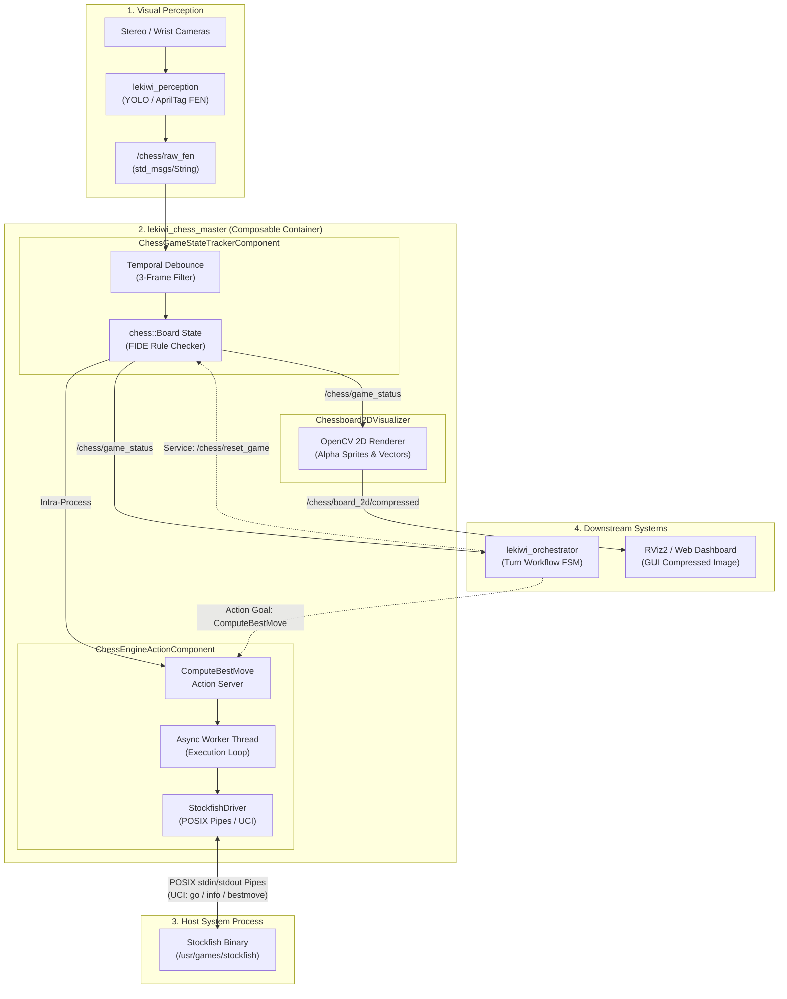

## Overview

The `lekiwi_chess_master` package serves as the cognitive chess engine and FIDE
match referee for the LeKiwi Autonomous Chess Playing Robot. Implemented in
modern C++17 as modular, zero-copy ROS 2 Composable Nodes, it bridges visual
board perceptions from cameras with grandmaster-level chess artificial
intelligence.

The package fulfills four core responsibilities in the LeKiwi architecture:

1. **Autonomous Chess AI**: Integrates the open-source **Stockfish** engine via
   a high-throughput, non-blocking POSIX pipe driver, wrapped in an asynchronous
   ROS 2 Action Server (`ComputeBestMove.action`).
2. **Game State Tracking & Referee**: Implements deterministic FIDE rule
   validation, temporal debounce filtering on raw camera vision inputs, legal
   move transitions, and match lifecycle management (`ChessGameStatus.msg`).
3. **Pure Domain Logic**: Encapsulates deterministic move classification,
   algebraic notation (SAN) generation, en-passant tracking, castling trajectory
   resolution, and pawn promotion mapping using the header-only `chess-library`.
4. **Digital 2D Board Visualizer**: Renders high-resolution top-down chessboard
   graphics with alpha-blended piece sprites, move highlight tints, vector arrows,
   and telemetry banners, streaming compressed JPEG frames for web dashboards and RViz.

### When to Use

- Orchestrating chess matches between LeKiwi and human opponents or simulated bots.
- Generating optimal UCI moves and calculating position evaluations (centipawns / mate).
- Validating physical chess moves detected by vision against strict FIDE rules.
- Streaming real-time 2D digital board displays for operator inspection or live streaming.

### When NOT to Use

- Low-level camera acquisition or AprilTag / piece detection
  (handled upstream by `lekiwi_perception`).
- Motion trajectory generation, inverse kinematics, or base navigation
  (handled downstream by `lekiwi_motion`).
- High-level task sequencing or camera mode switching
  (handled by `lekiwi_orchestrator`).

---

## System Architecture & Component Model

The package is engineered around the ROS 2 Component Model (`rclcpp_components`).
All three primary components execute inside a single multi-threaded process
(`component_container_mt`), utilizing **Intra-Process Communications (IPC)**
for zero-copy message transfers:



---

## Core Components & Capabilities

### 1. Stockfish Driver (`StockfishDriver`)

Located in [`stockfish_driver.hpp`](file:///root/docker_ws/lekiwi_ros2/lekiwi_chess_master/include/lekiwi_chess_master/stockfish_driver.hpp),
this subsystem encapsulates low-latency inter-process communication with the
Stockfish binary:

- **Anonymous POSIX Pipes**: Spawns Stockfish via `pipe(2)`, `fork(2)`, and
  `execvp(3)`, redirecting standard I/O streams without network overhead.
- **Non-blocking I/O**: Configures read descriptors with `O_NONBLOCK` and polls
  with `select(2)`, preventing engine stalls or frozen execution loops.
- **UCI Protocol Management**: Implements full stateful UCI handshake (`uci`
  $\rightarrow$ `isready` $\rightarrow$ `readyok`), dynamic position setting,
  asynchronous search cancellation (`stop`), and clean process teardown (`quit`).
- **Real-time Metric Parsing**: Extracts search depth (plies), evaluation score
  (centipawns or mate distance), nodes per second (NPS), and principal
  variations (PV) from raw `info` stream tokens.

### 2. Chess Engine Action Server (`ChessEngineActionComponent`)

Located in [`chess_engine_action_component.hpp`](file:///root/docker_ws/lekiwi_ros2/lekiwi_chess_master/include/lekiwi_chess_master/chess_engine_action_component.hpp),
this component exposes an asynchronous action server for
`lekiwi_interfaces/action/ComputeBestMove`:

- **Dedicated Worker Thread**: Engine calculations run on an independent
  `std::thread`, leaving the main ROS 2 executor free to handle incoming
  callbacks and heartbeat timers.
- **Continuous Feedback Streaming**: Emits search feedback containing current
  iteration depth, intermediate score, search speed, and principal variation line.
- **Preemption & Cancellation**: Supports immediate goal preemption; when a goal
  is canceled, the driver dispatches `stop\n` to Stockfish and halts within
  milliseconds.

### 3. Game State Tracker (`ChessGameStateTrackerComponent`)

Located in [`chess_game_state_tracker_component.hpp`](file:///root/docker_ws/lekiwi_ros2/lekiwi_chess_master/include/lekiwi_chess_master/chess_game_state_tracker_component.hpp),
this component maintains the canonical board truth and coordinates match phases:

- **Temporal Vision Debounce**: Filters visual noise by requiring $N$
  consecutive identical FEN placement frames (default: $N = 3$) before accepting
  a physical piece move.
- **Strict FIDE Rule Enforcement**: Validates observed transitions against
  legal moves generated by `chess::Board`. If an illegal transition is observed
  (e.g., knocked piece, occluded square), the status flags `is_legal_move = false`.
- **Autonomous & Guided Modes**:
  - *Dev / Self-Play*: Automatically triggers engine calculation on robot turns
    when `auto_trigger_engine: true`.
  - *Orchestrated Match*: Relies on `lekiwi_orchestrator` to coordinate active
    observation, validation, and engine dispatching.
- **Match State Broadcast**: Publishes comprehensive match telemetry
  (`/chess/game_status`) including 6-token FEN, move details, turn color, check,
  checkmate, draw, and evaluation score.

### 4. Digital 2D Board Visualizer (`Chessboard2DVisualizer`)

Located in [`chessboard_2d_visualizer.hpp`](file:///root/docker_ws/lekiwi_ros2/lekiwi_chess_master/include/lekiwi_chess_master/chessboard_2d_visualizer.hpp),
this component produces broadcast-quality digital chessboard imagery:

- **Dynamic Graphic Generation**: Generates a $480 \times 480\text{ px}$ canvas
  with checkered board tiles, rank/file coordinate margins, and alpha-blended
  PNG piece sprites loaded from `resources/pieces/`.
- **Visual Move Annotation**:
  - *Last Move*: Highlighted squares and motion vector arrow in emerald green.
  - *Best Move*: Highlighted squares and motion vector arrow in radiant amber.
  - *King in Check*: Red radial aura surrounding the threatened king.
- **Telemetry Banners**: Embedded status header showing turn, match phase, check
  state, and evaluation score (+ for White advantage, - for Black advantage).
- **Lightweight JPEG Compression**: Emits OpenCV-compressed JPEG buffers on
  `/chess/board_2d/compressed` at 5 Hz with SensorData QoS (best-effort),
  consuming minimal network bandwidth.

### 5. Pure C++ Domain Logic (`chess_domain.hpp`)

Located in [`chess_domain.hpp`](file:///root/docker_ws/lekiwi_ros2/lekiwi_chess_master/include/lekiwi_chess_master/chess_domain.hpp),
this module operates purely in memory with zero ROS 2 dependencies:

- Converts UCI strings (e.g. `e2e4`, `e7e8q`) into rich `ChessMoveDetails`
  messages.
- Detects special moves: En-passant captures, kingside/queenside castling rook
  trajectories, and promotion piece conversions.
- Generates Standard Algebraic Notation (SAN, e.g. `Nf3`, `O-O`, `exd5`) for
  match logging.

---

## Quick Start & Usage Guide

### 1. Launching Chess Master Subsystem

The recommended entry point is the composable container launch file in `lekiwi_bringup`:

```bash
# Launch Stockfish engine, game state tracker, and 2D visualizer
ros2 launch lekiwi_bringup chess_master.launch.py
```

To run individual nodes standalone for debugging:

```bash
# Run Stockfish Action Component directly
ros2 run lekiwi_chess_master chess_engine_action_node

# Run Game State Tracker Component directly
ros2 run lekiwi_chess_master chess_game_state_tracker_node

# Run 2D Visualizer Component directly
ros2 run lekiwi_chess_master chessboard_2d_visualizer_node
```

---

### 2. Requesting Best Move Calculation via Action Client

Send a computation goal directly from the CLI:

```bash
# Calculate best move from starting position with 1.5s thinking limit
ros2 action send_goal /chess/compute_best_move lekiwi_interfaces/action/ComputeBestMove \
  "{fen: 'rnbqkbnr/pppppppp/8/8/8/8/PPPPPPPP/RNBQKBNR w KQkq - 0 1', think_time_ms: 1500, depth: 0}" --feedback
```

**Sample Output:**
```text
Feedback:
  current_depth: 14
  current_eval: 28
  nodes_per_second: 1245000
  elapsed_time_ms: 1490
  current_pv: 'e2e4 e7e5 g1f3 b8c6'

Result:
  success: true
  best_move: 'e2e4'
  ponder_move: 'e7e5'
  eval_centipawns: 28
  is_mate: false
  mate_in_moves: 0
  message: 'Search completed successfully'
```

---

### 3. Resetting Game Board State

To reset the board state back to the standard FIDE starting layout:

```bash
ros2 service call /chess/reset_game std_srvs/srv/Trigger {}
```

---

### 4. Simulating Opponent Move via Vision Topic

Publish a raw FEN placement to simulate camera vision detection:

```bash
# Publish e2-e4 move (White moves pawn to e4)
ros2 topic pub --once /chess/raw_fen std_msgs/msg/String \
  "{data: 'rnbqkbnr/pppppppp/8/8/4P3/8/PPPP1PPP/RNBQKBNR'}"
```

---

### 5. Viewing 2D Board Stream in RViz / Web

- Add an **Image** display in RViz2.
- Set topic to `/chess/board_2d/compressed`.
- Set transport hint to `compressed`.

---

## ROS 2 Interface Specifications

### Action Interfaces

| Action Name | Type | Direction | Description |
| :--- | :---: | :---: | :--- |
| `/chess/compute_best_move` | `lekiwi_interfaces/action/ComputeBestMove` | Server | Computes optimal move using Stockfish engine with streaming search metrics. |

### Published Topics

| Topic Name | Message Type | QoS Profile | Description |
| :--- | :---: | :---: | :--- |
| `/chess/game_status` | `lekiwi_interfaces/msg/ChessGameStatus` | SystemDefaults (Reliable, Transient Local) | Canonical game state, turn, FEN, check flags, and move details. |
| `/chess/board_2d/compressed`| `sensor_msgs/msg/CompressedImage` | SensorData (Best Effort, Volatile) | Rendered $480 \times 480$ JPEG board image with piece overlays and arrows. |

### Subscribed Topics

| Topic Name | Message Type | QoS Profile | Description |
| :--- | :---: | :---: | :--- |
| `/chess/raw_fen` | `std_msgs/msg/String` | SensorData (Best Effort) | Raw piece placement string from vision detection pipeline. |
| `/chess/game_status` | `lekiwi_interfaces/msg/ChessGameStatus` | SystemDefaults | Consumed by `Chessboard2DVisualizer` for graphic generation. |

### Service Interfaces

| Service Name | Type | Description |
| :--- | :---: | :--- |
| `/chess/reset_game` | `std_srvs/srv/Trigger` | Resets board state machine to starting layout and aborts active searches. |

---

## Configuration Parameter Reference

Parameters are configured via `lekiwi_bringup/config/chess/chess_master_params.yaml`:

### Engine Action Component Parameters

| Parameter | Type | Default | Unit | Description |
| :--- | :---: | :---: | :---: | :--- |
| `stockfish_path` | `string` | `"/usr/games/stockfish"` | path | Absolute path to the Stockfish executable binary. |
| `think_time_ms` | `int` | `1000` | ms | Default calculation time budget if unspecified in goal. |
| `action_name` | `string` | `"/chess/compute_best_move"` | name | Action server registration topic name. |

### Game State Tracker Parameters

| Parameter | Type | Default | Unit | Description |
| :--- | :---: | :---: | :---: | :--- |
| `raw_fen_topic` | `string` | `"/chess/raw_fen"` | topic | Camera vision detection FEN input topic. |
| `game_status_topic` | `string` | `"/chess/game_status"` | topic | Canonical match state broadcast topic. |
| `debounce_frames` | `int` | `3` | frames | Consecutive stable vision frames required to accept a move. |
| `auto_trigger_engine`| `bool` | `true` | bool | Automatically trigger engine on robot turn (false in full orchestrator mode). |
| `robot_color` | `string` | `"black"` | color | Robot player side designation (`"white"` or `"black"`). |

### 2D Visualizer Parameters

| Parameter | Type | Default | Unit | Description |
| :--- | :---: | :---: | :---: | :--- |
| `board_2d_topic` | `string` | `"/chess/board_2d/compressed"`| topic | Output compressed JPEG topic. |
| `jpeg_quality` | `int` | `85` | % | JPEG compression quality factor ($1 - 100$). |
| `board_panel_size` | `int` | `480` | px | Square dimension of the rendered output image. |
| `debug` | `bool` | `true` | bool | Render vision debug overlays and status banners. |
| `render_rate_hz` | `double` | `5.0` | Hz | Maximum graphic rendering loop frequency. |

---

## Troubleshooting & Diagnostic Matrix

| Symptom / Error | Root Cause | Recommended Solution |
| :--- | :--- | :--- |
| `Failed to spawn Stockfish process` | Binary not found at `/usr/games/stockfish`. | Install Stockfish (`sudo apt install stockfish`) or update `stockfish_path` parameter. |
| `Illegal move detected from vision` | Pieces displaced, hand occluding board, or vision misclassification. | Verify lighting; check `/chess/raw_fen` stability; ensure opponent made a legal FIDE move. |
| `Game status not updating after human move` | Vision debounce threshold not met ($< 3$ frames). | Check camera framerate; verify camera is publishing stable `/chess/raw_fen` detections. |
| `Action goal rejected: Engine is busy` | A previous search goal is still active. | Cancel active goal with action client or allow search timeout to expire. |
| `Missing piece sprite assets` | Resource path unresolved by `ament_index_cpp`. | Rebuild package (`colcon build --packages-select lekiwi_chess_master`) to reinstall `resources/`. |
| `High CPU load during engine think` | Stockfish default multi-threading saturating host cores. | Adjust Stockfish `Threads` option via UCI parameters or limit `think_time_ms`. |

---

## Verification & Unit Testing

The package includes four comprehensive GTest suites covering pure domain logic,
subprocess pipe handling, game tracking debounce, and action server execution:

```bash
# Build package with test targets enabled
colcon build --packages-select lekiwi_chess_master --cmake-args -DBUILD_TESTING=ON

# Run all test suites
colcon test --packages-select lekiwi_chess_master --event-handlers console_direct+

# Inspect test results
colcon test-result --verbose
```

### Test Suite Descriptions

- **`test_chess_domain`**: Validates legal move generation, en-passant coordinate
  resolution, castling trajectories, promotion types, and SAN notation translation.
- **`test_stockfish_driver`**: Verifies POSIX pipe initialization, UCI handshake
  timing, search metric parsing, and immediate cancellation under timeout constraints.
- **`test_game_state_tracker`**: Asserts debounce frame accumulation, turn color
  switching, checkmate / stalemate detection, and `/chess/reset_game` service handling.
- **`test_chess_engine_action`**: Tests action server lifecycle, goal acceptance,
  worker thread execution, feedback streaming, and preemption.
