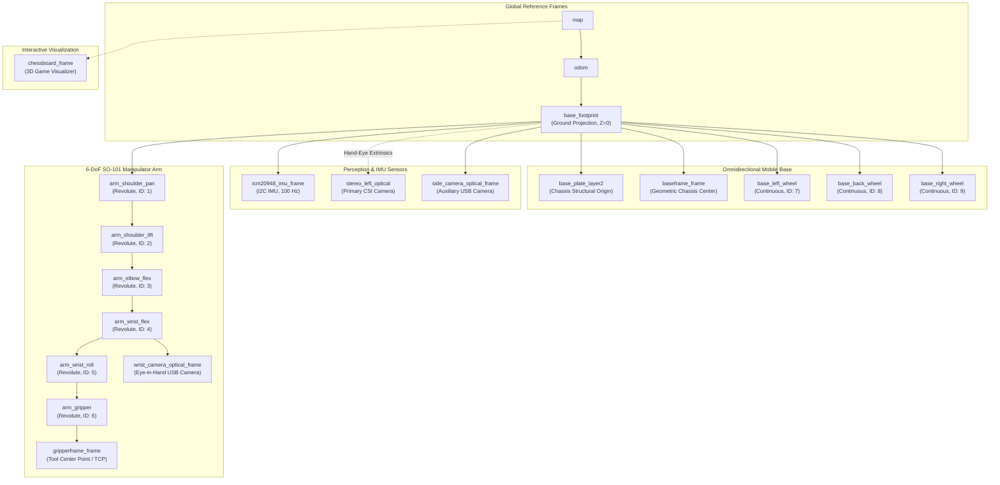

## Overview

The `lekiwi_description` package serves as the single source of truth for the physical, kinematic, sensor, and visual models of the **LeKiwi** mobile manipulator robot. It integrates high-fidelity CAD meshes, modular Xacro macros, `ros2_control` hardware abstraction tags, hand-eye extrinsics calibration profiles, and multi-perspective RViz2/RQt visualization environments.

### Key Capabilities

- **Unified Parametric Kinematics**: Complete spatial model of the 3-wheel omnidirectional chassis and the 6-DoF SO-101 robotic arm with precise joint limits, inertial properties, and visual/collision geometries.
- **Hardware-Agnostic `ros2_control` Integration**: Modular Xacro macros (`ros2_control.xacro`) supporting seamless switching between `real` hardware (STS3215 serial bus servos, ICM20948 I2C IMU) and `mock` simulated backends without modifying kinematic definitions.
- **Calibrated Sensor Coordinate Frames**: Dynamic injection of hand-eye extrinsic calibration transforms (`sensors_calibration.xacro`) linking the stereo camera optical frame directly to the base footprint.
- **Interactive 3D Game & Telemetry Visualizer**: Dedicated ROS 2 Python node (`chessboard_3d_visualizer.py`) rendering 3D STL chess pieces, board square highlights, and move trajectory vectors dynamically in RViz2 based on `/chess/game_status`.
- **Pre-Configured Inspection Environments**: Turn-key launch configurations and saved profiles for model inspection, live full-robot telemetry, camera feed overlays, and unified RQt debugging dashboards.

---

## Architecture & Kinematic Tree

The robot kinematic chain originates at `base_footprint` on the ground plane, branching into the omnidirectional wheel assemblies, the IMU sensor frame, the multi-camera optical frames, and the serial 6-DoF arm ending at the parallel jaw gripper.



---

## Core Concepts & Technical Specifications

### 1. Actuated Joint Specifications

LeKiwi is actuated by 9 Feetech STS3215 serial bus servos communicating over a half-duplex UART bus at 1 Mbps.

| Joint Name | Kinematic Type | Hardware Interface | Servo ID | Motion Limits / Velocity Scale | Default Acceleration |
| :--- | :--- | :--- | :--- | :--- | :--- |
| `arm_shoulder_pan` | `revolute` | `position` | 1 | $[-1.85, +1.85]\ \text{rad}$ | 50 |
| `arm_shoulder_lift` | `revolute` | `position` | 2 | $[-1.80, +1.80]\ \text{rad}$ | 50 |
| `arm_elbow_flex` | `revolute` | `position` | 3 | $[-1.80, +1.80]\ \text{rad}$ | 50 |
| `arm_wrist_flex` | `revolute` | `position` | 4 | $[-1.80, +1.80]\ \text{rad}$ | 50 |
| `arm_wrist_roll` | `revolute` | `position` | 5 | $[-3.14, +3.14]\ \text{rad}$ | 50 |
| `arm_gripper` | `revolute` | `position` | 6 | $[-0.20, +1.57]\ \text{rad}$ | 50 |
| `base_left_wheel` | `continuous` | `velocity` | 7 | $0.001534\ \text{rad/s/tick}\ (\text{dir: } -1)$ | 0 (Immediate) |
| `base_back_wheel` | `continuous` | `velocity` | 8 | $0.001534\ \text{rad/s/tick}\ (\text{dir: } -1)$ | 0 (Immediate) |
| `base_right_wheel` | `continuous` | `velocity` | 9 | $0.001534\ \text{rad/s/tick}\ (\text{dir: } -1)$ | 0 (Immediate) |

### 2. Modular Xacro Composition

The top-level model entry point is [`urdf/lekiwi_robot.urdf.xacro`](file:///root/docker_ws/lekiwi_ros2/lekiwi_description/urdf/lekiwi_robot.urdf.xacro), which composes three decoupled modules:

```
lekiwi_robot.urdf.xacro (Top-Level Entrypoint)
  ├── duykhongcay_lekiwi.urdf       -> Pure geometric CAD links, meshes, and joint transforms
  ├── ros2_control.xacro            -> ros2_control system & sensor hardware tags
  └── sensors_calibration.xacro     -> Hand-eye calibration YAML loader for camera extrinsics
```

- **`hardware_type` Argument**:
  - `mock`: Uses `mock_components/GenericSystem` for offline testing, RViz simulation, and automated CI pipelines without physical actuators.
  - `real`: Binds joints to `lekiwi_ftservo_hardware/LeKiwiFeetechHardwareInterface` over `/dev/lekiwi_serial`.
- **`enable_imu` Argument**:
  - Automatically loads `lekiwi_icm20948_hardware/ICM20948SensorHardware` on I2C bus 1 (address `0x68`) providing 13 asynchronous state interfaces (`orientation.x/y/z/w`, `angular_velocity.x/y/z`, `linear_acceleration.x/y/z`, `magnetic_field.x/y/z`).

### 3. Hand-Eye Camera Extrinsic Calibration

Camera placement on mobile manipulators often shifts slightly during assembly. Rather than hardcoding optical frame coordinates in CAD:
- [`sensors_calibration.xacro`](file:///root/docker_ws/lekiwi_ros2/lekiwi_description/urdf/sensors_calibration.xacro) dynamically parses `handeye_calib_stereo_left.yaml` at runtime.
- Extrinsic parameters (translation vector $\mathbf{t} = [x, y, z]$ and Euler rotation angles $\mathbf{r} = [\phi, \theta, \psi]$) are computed via the Tsai-Lenz / Park hand-eye calibration solver and injected into the `stereo_left_optical_joint`:

$$\mathbf{T}_{\text{base\_footprint}}^{\text{stereo\_left\_optical}} = \begin{bmatrix} \mathbf{R}(\phi, \theta, \psi) & \mathbf{t} \\ \mathbf{0}_{1 \times 3} & 1 \end{bmatrix}$$

- If no calibration file is provided, it falls back to nominal verified defaults:
  - Translation: $[-0.041920, +0.034605, +0.411475]\ \text{m}$
  - Rotation (RPY): $[-2.392200, +0.013614, -1.566144]\ \text{rad}$

### 4. 3D Chessboard State Visualizer (`chessboard_3d_visualizer.py`)

A specialized visualization engine that bridges high-level game logic (`lekiwi_interfaces/msg/ChessGameStatus`) with 3D RViz2 displays:
- Translates FEN piece strings into full 3D STL mesh representations in the `chessboard_frame`.
- Displays real-time move overlays:
  - **Yellow Highlight**: Origin and target squares of the last executed move.
  - **Red Flashing Highlight**: King in check.
  - **Green Translucent Arrow**: Trajectory vector of Stockfish recommended move.
- Square dimension: $47.5\ \text{mm} \times 47.5\ \text{mm}$; Board surface height: $Z = 6\ \text{mm}$.

### 5. Mesh Normalization Utility (`recenter_chess_pieces.py`)

To ensure 3D chess pieces align perfectly on the board squares in RViz without programmatic origin hacks:
- Parses binary STL header and facet records.
- Computes Axis-Aligned Bounding Box (AABB) $[\min, \max]$ for $X, Y, Z$.
- Offsets all vertex coordinates such that $X_{\text{center}} = 0.0$, $Y_{\text{center}} = 0.0$, and $Z_{\text{base}} = 0.0$.
- Supports `--dry-run` inspection and automated backup into `raw_backup/`.

---

## Package Structure

```text
lekiwi_description/
├── assets/                          # 3D binary STL meshes for robot chassis, arm, and sensors
│   ├── chess_pieces/                # High-poly 3D STL models for all 12 chess pieces
│   ├── base_plate_layer1_v5_1.stl   # Bottom omniwheel chassis plate
│   ├── base_plate_layer2_v3_1.stl   # Top payload chassis plate
│   ├── sts3215_*.stl                # Feetech servo housings and horn geometries
│   ├── imx219_stereo_cam.stl        # Dual CSI stereo camera mount mesh
│   └── moving_jaw_so101_v1.stl      # Parallel jaw gripper finger
├── config/                          # Central configuration and calibration directory
│   ├── calibration/                 # Calibration profiles
│   │   ├── DuyKhongCay.json         # Raw servo hardware calibration
│   │   ├── handeye_calib_stereo_left.yaml # Calibrated stereo camera extrinsics
│   │   └── sts3215_servos_calib.yaml # Bus servo limits and zero offsets
│   ├── rqt/                         # RQt GUI perspectives
│   │   └── lekiwi_debug.perspective # Multi-pane inspection dashboard
│   └── rviz/                        # Pre-configured RViz2 display profiles
│       ├── lekiwi_full.rviz         # Complete robot telemetry (TF, RobotModel, Sensors)
│       ├── lekiwi_model_only.rviz   # Isolated CAD inspection profile
│       └── lekiwi_perception.rviz   # Camera streams and perception marker overlays
├── launch/
│   ├── description.launch.py        # Evaluates Xacro and launches robot_state_publisher
│   └── visualizer.launch.py         # Complete RViz2 + 3D chess visualizer launch
├── scripts/
│   ├── chessboard_3d_visualizer.py  # Python node rendering 3D chess game state in RViz
│   └── recenter_chess_pieces.py     # Binary STL normalization utility
├── urdf/
│   ├── duykhongcay_lekiwi.urdf      # Core CAD kinematic definitions and visual/collision geometries
│   ├── lekiwi_robot.urdf.xacro      # Top-level composition Xacro entry point
│   ├── ros2_control.xacro           # ros2_control system and sensor hardware macros
│   └── sensors_calibration.xacro    # Dynamic YAML hand-eye calibration loader
├── CMakeLists.txt
└── package.xml
```

---

## Quick Start & Usage

### 1. Build the Package

Compile `lekiwi_description` in your ROS 2 workspace:

```bash
cd /root/docker_ws
colcon build --packages-select lekiwi_description --symlink-install
source install/setup.bash
```

### 2. Offline Model Inspection & Joint Slider Control

To verify URDF kinematics and test joint limits without connecting physical hardware:

```bash
ros2 launch lekiwi_description visualizer.launch.py \
  rviz_config:=$(ros2 pkg prefix lekiwi_description)/share/lekiwi_description/config/rviz/lekiwi_model_only.rviz
```

*To launch interactive joint sliders:*
```bash
ros2 run joint_state_publisher_gui joint_state_publisher_gui
```

### 3. Full Robot Telemetry Visualization

When running on the live robot or connecting from a remote development workstation:

```bash
# Default launches lekiwi_full.rviz with 3D chessboard visualizer
ros2 launch lekiwi_description visualizer.launch.py

# Perception inspection mode (camera feeds, detected tags, feasibility markers)
ros2 launch lekiwi_description visualizer.launch.py \
  rviz_config:=$(ros2 pkg prefix lekiwi_description)/share/lekiwi_description/config/rviz/lekiwi_perception.rviz
```

### 4. Headless Robot State Publisher Launch

When running embedded on the robot's onboard Raspberry Pi 5 without graphical display:

```bash
# Real hardware deployment
ros2 launch lekiwi_description description.launch.py hardware_type:=real

# Mock hardware mode
ros2 launch lekiwi_description description.launch.py hardware_type:=mock
```

### 5. Multi-Topic Debugging via RQt

Launch the pre-configured RQt debugging perspective containing Topic Monitor, Service Caller, TF Tree Viewer, and Node Graph:

```bash
rqt --perspective-file $(ros2 pkg prefix lekiwi_description)/share/lekiwi_description/config/rqt/lekiwi_debug.perspective
```

### 6. Recenter 3D STL Piece Meshes

If importing custom CAD chess sets:

```bash
# Dry run inspection of mesh bounds
python3 $(ros2 pkg prefix lekiwi_description)/lib/lekiwi_description/recenter_chess_pieces.py --dry-run

# Execute vertex normalization with automatic backup
python3 $(ros2 pkg prefix lekiwi_description)/lib/lekiwi_description/recenter_chess_pieces.py
```

---

## ROS 2 Interface Specifications

### 1. Published Topics

| Topic Name | Message Type | Quality of Service (QoS) | Publishing Node | Description |
| :--- | :--- | :--- | :--- | :--- |
| `/robot_description` | `std_msgs/msg/String` | Transient Local, Reliable, Depth 1 | `robot_state_publisher` | Full evaluated URDF XML string describing robot kinematics. |
| `/tf` | `tf2_msgs/msg/TFMessage` | Dynamic, Best Effort | `robot_state_publisher` | Dynamic coordinate transforms for actuated revolute/continuous joints. |
| `/tf_static` | `tf2_msgs/msg/TFMessage` | Transient Local, Reliable | `robot_state_publisher` | Fixed sensor mounts, camera brackets, and chassis frame transforms. |
| `/chess/game_markers` | `visualization_msgs/msg/MarkerArray` | Transient Local, Reliable | `chessboard_3d_visualizer` | 3D STL chess pieces, board highlight squares, and move arrows. |

### 2. Subscribed Topics

| Topic Name | Message Type | QoS | Subscribing Node | Purpose |
| :--- | :--- | :--- | :--- | :--- |
| `/joint_states` | `sensor_msgs/msg/JointState` | Sensor Data / Best Effort | `robot_state_publisher` | Actuator positions used to update the dynamic TF tree. |
| `/chess/game_status` | `lekiwi_interfaces/msg/ChessGameStatus` | Transient Local / Reliable | `chessboard_3d_visualizer` | FEN board state, last move, check status, and Stockfish suggestions. |

### 3. Coordinate Frames Reference (TF Tree)

| Frame ID | Parent Frame | Joint Type | Description |
| :--- | :--- | :--- | :--- |
| `base_footprint` | `odom` / `map` | Dynamic (Nav/EKF) | Ground contact plane projection directly beneath the robot center. |
| `baseframe_frame` | `base_footprint` | `fixed` | Chassis physical center of rotation. |
| `icm20948_imu_frame`| `base_footprint` | `fixed` | Position and orientation of the onboard 9-DoF IMU sensor. |
| `stereo_left_optical`| `base_footprint`| `fixed` (Calibrated) | Optical frame of the primary forward-facing CSI camera. |
| `side_camera_optical_frame` | `base_footprint` | `fixed` | Optical frame of the chassis perimeter USB inspection camera. |
| `wrist_camera_optical_frame`| `arm_wrist_flex` | `fixed` | Eye-in-hand camera optical frame attached to the wrist pitch link. |
| `gripperframe_frame`| `arm_gripper` | `fixed` | Tool Center Point (TCP) between the parallel gripper jaws. |
| `chessboard_frame` | `map` | `fixed` / Dynamic | Spatial frame located at the physical center of the chessboard. |

---

## Launch Arguments Reference

### `description.launch.py`

| Argument Name | Type | Default Value | Description |
| :--- | :--- | :--- | :--- |
| `hardware_type` | `string` | `"real"` | Target hardware interface: `"real"` (Feetech hardware driver) or `"mock"` (generic simulated system). |
| `use_sim_time` | `bool` | `false` | Synchronizes nodes to simulation `/clock` when set to `true`. |
| `robot_description_topic` | `string` | `"robot_description"` | Topic name on which to publish the URDF XML model string. |

### `visualizer.launch.py`

| Argument Name | Type | Default Value | Description |
| :--- | :--- | :--- | :--- |
| `rviz_config` | `string` | `lekiwi_full.rviz` | Absolute filesystem path to the target RViz2 `.rviz` configuration file. |
| `use_sim_time` | `bool` | `false` | Synchronizes visualization nodes to simulation clock. |
| `visualize_chess_game` | `bool` | `true` | Conditionally spawns `chessboard_3d_visualizer.py` for 3D game telemetry. |

---

## Troubleshooting & Diagnostics

| Symptom | Probable Root Cause | Resolution & Verification |
| :--- | :--- | :--- |
| RViz displays error: `"No transform from [arm_base] to [base_footprint]"` | `robot_state_publisher` is not running, or `/joint_states` topic is empty. | Verify node execution: `ros2 node list \| grep robot_state_publisher`. Inspect joint state publishing: `ros2 topic echo /joint_states`. |
| Stereo camera frames misaligned in RViz relative to point clouds | Calibrated extrinsics file not found or corrupted, falling back to nominal defaults. | Verify existence of `config/calibration/handeye_calib_stereo_left.yaml`. Re-run calibration via `lekiwi_calibration` hand-eye tool if camera mount was adjusted. |
| STL mesh fails to load in RViz with `"Could not load resource: package://..."` | Package share path not found or missing package environment sourcing. | Ensure workspace is sourced: `source install/setup.bash`. Verify asset installation in `install/lekiwi_description/share/lekiwi_description/assets/`. |
| Xacro command fails with `"unknown macro: lekiwi_ros2_control"` | Incomplete Xacro include statements or syntax error in `ros2_control.xacro`. | Validate Xacro parsing manually: `xacro $(ros2 pkg prefix lekiwi_description)/share/lekiwi_description/urdf/lekiwi_robot.urdf.xacro`. |
| 3D chess pieces do not render in RViz | `chessboard_3d_visualizer` node not spawned, or `/chess/game_status` topic has not received any game state messages. | Set `visualize_chess_game:=true` in launch arguments. Echo topic: `ros2 topic echo /chess/game_status`. Check Fixed Frame is set to `chessboard_frame` or `map`. |

---

## Verification & Kinematic Validation

To validate the integrity of the URDF/Xacro kinematic chain without launching the ROS 2 runtime:

### 1. Parse and Validate Xacro Generation

```bash
# Expand Xacro into full URDF XML
xacro $(ros2 pkg prefix lekiwi_description)/share/lekiwi_description/urdf/lekiwi_robot.urdf.xacro \
  hardware_type:=mock > /tmp/lekiwi_expanded.urdf

# Check for kinematic tree cycles and unlinked links
check_urdf /tmp/lekiwi_expanded.urdf
```

### 2. Inspect TF Coordinate Hierarchy Graph

Verify all parent-child relationships and update rates across the active TF tree:

```bash
ros2 run tf2_tools view_frames
evince frames.pdf
```
