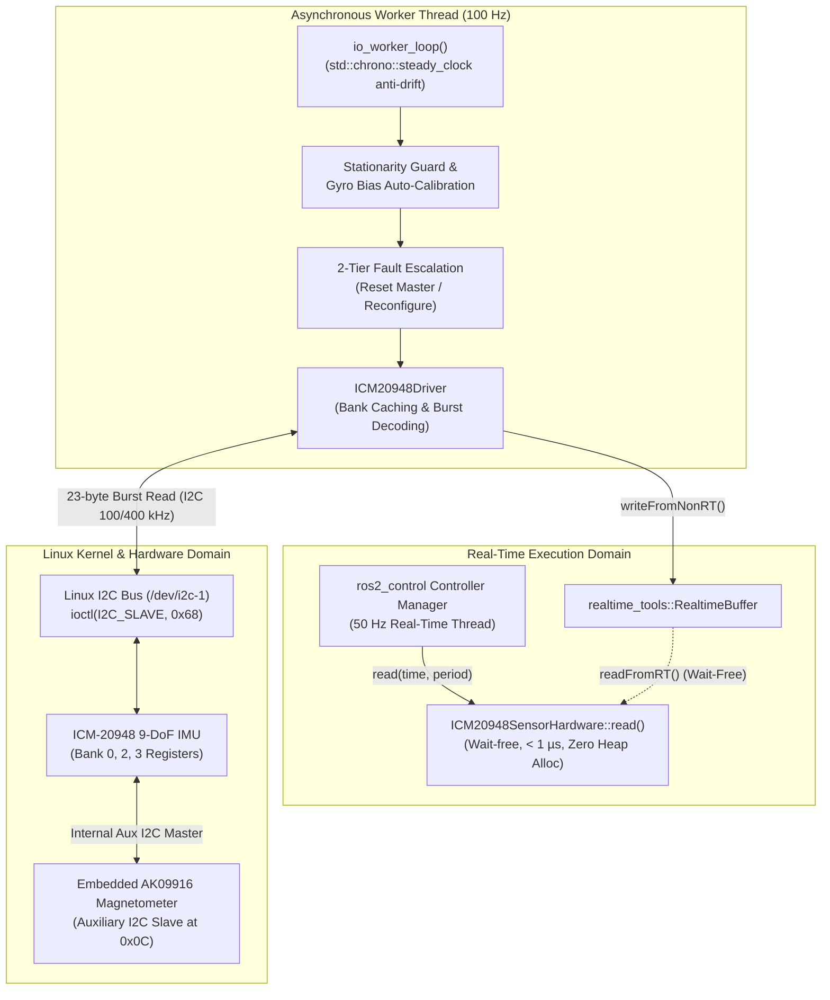
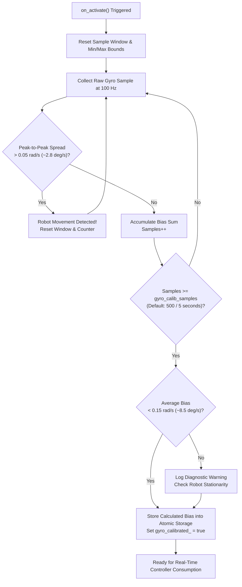

## Overview

The `lekiwi_icm20948_hardware` package provides a real-time `ros2_control`
hardware interface plugin (`SensorInterface`) designed for the TDK InvenSense
ICM-20948 9-Axis MotionTracking device (integrated 3-axis gyroscope, 3-axis
accelerometer, and Asahi Kasei AK09916 3-axis magnetometer) on the LeKiwi robot.

Communicating directly over the Linux `/dev/i2c-1` interface at 7-bit slave
address `0x68` (or alternate `0x69`), the driver provides deterministic,
bounded-latency data acquisition through an asynchronous background polling
architecture. The hard real-time control loop achieves wait-free state updates
(< 1 µs execution time) with zero dynamic memory allocation on the critical path.

---

## Architecture and Concurrency Model

The hardware interface isolates low-frequency I2C serial transactions from the
strict timing requirements of the ros2_control controller loop using a
double-buffered lock-free memory architecture.



### Key Technical Characteristics

- **Wait-Free Real-Time Contract**: The `read()` method interacts strictly with
  `realtime_tools::RealtimeBuffer`, guaranteeing zero mutex contention and zero
  operating system scheduling delays.
- **Asynchronous 100 Hz Polling**: A dedicated worker thread reads the physical
  sensor at 100 Hz using `std::this_thread::sleep_until` to eliminate timing jitter.
- **Atomic 23-Byte Burst Transfer**: All 9 degrees of freedom (accelerometer,
  gyroscope, temperature, and magnetometer) are fetched in a single contiguous
  I2C read transaction starting from `REG_B0_ACCEL_XOUT_H` (0x2D).
- **Zero Heap Allocation**: State interface names and diagnostic buffers are
  pre-allocated during `on_init`, preventing runtime memory fragmentation.
- **Mock Simulation Support**: Supports headless execution without physical I2C
  hardware (`mock_sensor: true`) for CI/CD pipelines and unit testing.

---

## Sensor State Interfaces and REP-103 Conventions

The plugin exports 13 state interfaces registered under the configured sensor
name (default: `icm20948_imu`), conforming strictly to ROS standard REP-103.

| Interface Name | Data Type | Physical Unit | Default / Range | REP-103 Semantic Convention |
| :--- | :--- | :--- | :--- | :--- |
| `orientation.x` | `double` | Quaternion | 0.0 | Unit quaternion component X |
| `orientation.y` | `double` | Quaternion | 0.0 | Unit quaternion component Y |
| `orientation.z` | `double` | Quaternion | 0.0 | Unit quaternion component Z |
| `orientation.w` | `double` | Quaternion | 1.0 (Identity) | Unit quaternion scalar component W |
| `angular_velocity.x` | `double` | rad/s | ±17.45 rad/s | Angular rate around Body X (Roll rate) |
| `angular_velocity.y` | `double` | rad/s | ±17.45 rad/s | Angular rate around Body Y (Pitch rate) |
| `angular_velocity.z` | `double` | rad/s | ±17.45 rad/s | Angular rate around Body Z (Yaw rate) |
| `linear_acceleration.x` | `double` | m/s² | ±39.24 m/s² | Specific force along Body X-axis |
| `linear_acceleration.y` | `double` | m/s² | ±39.24 m/s² | Specific force along Body Y-axis |
| `linear_acceleration.z` | `double` | m/s² | +9.80665 m/s² | Specific force along Body Z-axis (+1g upright) |
| `magnetic_field.x` | `double` | Tesla (T) | ±4900 µT | Magnetic flux density along Body X |
| `magnetic_field.y` | `double` | Tesla (T) | ±4900 µT | Magnetic flux density along Body Y |
| `magnetic_field.z` | `double` | Tesla (T) | ±4900 µT | Magnetic flux density along Body Z |

### Coordinate Frame and Die Alignment

The embedded AK09916 magnetometer silicon die is oriented differently from the
ICM-20948 accelerometer/gyroscope body frame. Per InvenSense DS-000189
(Section 15, Figures 12 and 13), the driver applies hardware axis alignment:

- $X_{imu} = +X_{mag}$
- $Y_{imu} = -Y_{mag}$
- $Z_{imu} = -Z_{mag}$

Magnetometer raw LSB readings are converted to Tesla using the AK09916 sensitivity
scale factor of $0.15 \times 10^{-6} \text{ T/LSB}$ ($0.15\,\mu\text{T/LSB}$).

---

## Register Architecture and I2C Communication

The ICM-20948 organizes its configuration registers into four distinct banks
(Bank 0 through Bank 3), selected via `REG_BANK_SEL` (register address `0x7F`).

```text
+-------------------------------------------------------------------------------+
| ICM-20948 Register Organization                                               |
+-------------------+-------------------+-------------------+-------------------+
| User Bank 0 (0x00)| User Bank 1 (0x10)| User Bank 2 (0x20)| User Bank 3 (0x30)|
+-------------------+-------------------+-------------------+-------------------+
| WHO_AM_I (0xEA)   | Self-test registers| GYRO_SMPLRT_DIV   | I2C_MST_ODR_CONFIG|
| USER_CTRL (I2C_MST| DMP memory and    | GYRO_CONFIG_1     | I2C_MST_CTRL      |
| PWR_MGMT_1 / 2    | time-base configs | ACCEL_SMPLRT_DIV  | I2C_SLV0_ADDR/REG |
| ACCEL_X/Y/ZOUT    |                   | ACCEL_CONFIG      | I2C_SLV0_CTRL     |
| GYRO_X/Y/ZOUT     |                   | (DLPF filter selection| I2C_SLV4 (One-shot|
| EXT_SLV_SENS_DATA |                   | and FSR scaling)  | Aux I/O payload)  |
+-------------------+-------------------+-------------------+-------------------+
```

### Bank Selection Caching

To avoid redundant bus transactions, `ICM20948Driver` maintains an internal
cache of the active register bank. Writes to `REG_BANK_SEL` are bypassed if the
requested bank matches the current cached state.

### Auxiliary I2C Master Integration for AK09916

Direct host access to the embedded AK09916 magnetometer requires routing through
the ICM-20948 internal auxiliary I2C master:

1. **One-Shot Initialization (Slave 4)**: The driver uses the internal Slave 4
   transceiver (`REG_B3_I2C_SLV4_*`) to write software reset (`CNTL3`), verify
   device ID (`WIA2 = 0x09`), and configure continuous 100 Hz sampling (`CNTL2`).
2. **Continuous Automatic Burst Mirroring (Slave 0)**: The driver configures
   internal Slave 0 (`REG_B3_I2C_SLV0_*`) to poll 9 consecutive bytes from the
   magnetometer (`REG_AK09916_ST1` through `REG_AK09916_ST2`) at ~137.5 Hz ODR.
   The results are mirrored into the ICM-20948 external sensor data buffer
   (`REG_B0_EXT_SLV_SENS_DATA`, 0x3B).
3. **Single Burst Transfer (23 Bytes)**: The host reads 23 contiguous bytes
   starting from Bank 0 `0x2D` in one single I2C ioctl transaction:
   - Bytes 0..5: Accelerometer X, Y, Z (Big-Endian, signed 16-bit)
   - Bytes 6..11: Gyroscope X, Y, Z (Big-Endian, signed 16-bit)
   - Bytes 12..13: Temperature sensor (Big-Endian, signed 16-bit)
   - Byte 14: Magnetometer Status 1 (`ST1`, Data Ready check)
   - Bytes 15..20: Magnetometer X, Y, Z (Little-Endian, signed 16-bit)
   - Byte 21: Dummy temperature byte (`TMPS`)
   - Byte 22: Magnetometer Status 2 (`ST2`, Magnetic Overflow check)

---

## Gyroscope Calibration and Stationarity Guard

Zero-rate bias drift in MEMS gyroscopes can severely impact robot heading
estimation. The package provides an automatic zero-motion calibration sequence
executed upon entering the `on_activate` lifecycle state.



### Stationarity Guard Details

- **Peak-to-Peak Window Filter**: The driver continuously tracks `gyro_max` and
  `gyro_min` across the sampling window. If the difference on any axis exceeds
  0.05 rad/s (~2.8 deg/s), the robot is considered in motion, and the calibration
  window automatically restarts with a throttled warning.
- **Plausibility Check**: The computed mean bias is verified against a maximum
  realistic threshold of 0.15 rad/s (~8.5 deg/s) to catch sensor hardware damage.
- **Manual Parameter Fallback**: If `auto_calibrate_gyro` is set to `false`, the
  driver applies static user-specified offsets from `gyro_bias_x`, `gyro_bias_y`,
  and `gyro_bias_z`.

---

## Fault Escalation and Self-Healing

To protect against transient I2C bus lockups (e.g., SDA held low by a slave device
or clock stretching timeouts), the worker thread enforces a tiered recovery policy:

- **Tier 1 (Single Read Failure)**: Increments error telemetry counters and retains
  the previous valid sensor snapshot.
- **Tier 2 (5 Consecutive Errors / 50 ms)**: Triggers an auxiliary I2C master logic
  reset (`USER_CTRL` bit 1) to clear AK09916 auxiliary bus deadlocks.
- **Tier 3 (10 Consecutive Errors / 100 ms)**: Invalidates the internal bank cache
  and re-executes full chip software reset, clock configuration, and sensor setup
  (`configure_device`).

---

## URDF and ros2_control Configuration

The hardware component is declared in the robot description Xacro within a
`<ros2_control>` block of type `sensor`.

### Hardware Parameters

| Parameter | Type | Default | Description |
| :--- | :--- | :--- | :--- |
| `mock_sensor` | `bool` | `false` | Generates stationary mock data without physical hardware |
| `i2c_bus` | `int` | `1` | Linux I2C device bus index (`/dev/i2c-1`) |
| `i2c_address` | `string` | `"0x68"` | 7-bit I2C device address (`"0x68"` or `"0x69"`) |
| `accel_range` | `string` | `"4G"` | Full-scale acceleration range: `2G`, `4G`, `8G`, `16G` |
| `gyro_range` | `string` | `"1000DPS"` | Full-scale gyroscope range: `250DPS`, `500DPS`, `1000DPS`, `2000DPS` |
| `dlpf_config` | `string` | `"3"` | Digital Low Pass Filter bandwidth setting (0..7) |
| `auto_calibrate_gyro` | `bool` | `true` | Enables zero-motion gyro calibration at startup |
| `gyro_calib_samples` | `int` | `500` | Sample count for gyro calibration (500 samples @ 100 Hz = 5 s) |
| `gyro_bias_x / y / z` | `double` | `0.0` | Manual static gyro bias offsets in rad/s |
| `accel_bias_x / y / z`| `double` | `0.0` | Manual static accelerometer bias offsets in m/s² |
| `accel_axis_sign_x / y / z` | `int` | `1` | Accelerometer axis sign multiplier (`1` or `-1`) |
| `gyro_axis_sign_x / y / z` | `int` | `1` | Gyroscope axis sign multiplier (`1` or `-1`) |
| `mag_axis_sign_x / y / z` | `int` | `1` | Magnetometer axis sign multiplier (`1` or `-1`) |

### Example URDF Definition

```xml
<ros2_control name="LeKiwiImu" type="sensor" is_async="true">
  <properties>
    <async scheduling_policy="detached" print_warnings="false" thread_priority="30"/>
  </properties>
  <hardware>
    <plugin>lekiwi_icm20948_hardware/ICM20948SensorHardware</plugin>
    <param name="mock_sensor">false</param>
    <param name="i2c_bus">1</param>
    <param name="i2c_address">0x68</param>
    <param name="accel_range">4G</param>
    <param name="gyro_range">1000DPS</param>
    <param name="auto_calibrate_gyro">true</param>
    <param name="gyro_calib_samples">500</param>
  </hardware>
  <sensor name="icm20948_imu">
    <state_interface name="orientation.x"/>
    <state_interface name="orientation.y"/>
    <state_interface name="orientation.z"/>
    <state_interface name="orientation.w"/>
    <state_interface name="angular_velocity.x"/>
    <state_interface name="angular_velocity.y"/>
    <state_interface name="angular_velocity.z"/>
    <state_interface name="linear_acceleration.x"/>
    <state_interface name="linear_acceleration.y"/>
    <state_interface name="linear_acceleration.z"/>
    <state_interface name="magnetic_field.x"/>
    <state_interface name="magnetic_field.y"/>
    <state_interface name="magnetic_field.z"/>
    <param name="frame_id">icm20948_imu</param>
  </sensor>
</ros2_control>
```

---

## Diagnostics and Health Telemetry

When loaded inside a node-enabled controller manager, `ICM20948SensorHardware`
publishes real-time telemetry to `/diagnostics` using `diagnostic_updater`:

| Telemetry Key | Normal Status | Warning (WARN) | Error (ERROR) |
| :--- | :--- | :--- | :--- |
| `Hardware Status` | IMU hardware OK | Transient read errors | Consecutive errors > 10 |
| `I2C Device` | `/dev/i2c-1 (0x68)` | - | Bus path unavailable |
| `I2C Error Rate (%)` | < 0.5% | 0.5% to 5.0% | > 5.0% |
| `Consecutive Read Errors`| 0 | 1 to 9 errors | >= 10 errors |
| `Gyro Calibrated` | Yes | In Progress (sample count) | Incomplete |
| `Calculated Gyro Bias` | Bias vectors < 0.15 rad/s | Exceeds plausibility | Uncalibrated |

---

## Verification and Troubleshooting

### Hardware Bus Verification

Check if the ICM-20948 is detected on the I2C bus using standard Linux tools:

```bash
# Scan I2C bus 1 (expected output: device at 0x68)
i2cdetect -y 1
```

If the device is not detected:
1. Verify 3.3V power, GND, SCL, and SDA wiring on the Raspberry Pi 40-pin header.
2. Confirm AD0 pin is connected to GND (for `0x68`) or 3.3V (for `0x69`).
3. Ensure user account belongs to the `i2c` group (`sudo usermod -aG i2c $USER`).

### Build and Unit Testing

Build the package and run GoogleTest unit tests covering scale factors and codecs:

```bash
# Build package
colcon build --packages-select lekiwi_icm20948_hardware --symlink-install

# Run unit tests
colcon test --packages-select lekiwi_icm20948_hardware --event-handlers console_direct+
colcon test-result --verbose
```

### Runtime Inspection

Verify active state interfaces once the robot controller manager is active:

```bash
# Verify exported hardware interfaces
ros2 control list_hardware_interfaces | grep icm20948

# Inspect published IMU messages
ros2 topic echo /imu/data_raw
```
