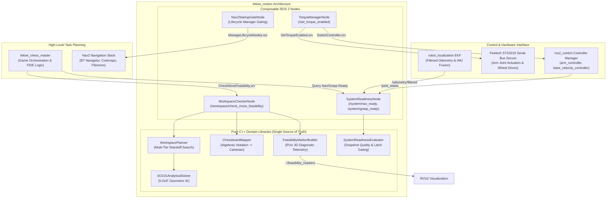

## Overview

The `lekiwi_motion` package provides high-performance motion coordination, analytical kinematics, workspace reachability validation, hardware safety supervision, and system-level gating for the **LeKiwi** mobile manipulator robot. Operating between high-level task planners (such as `lekiwi_chess_master`) and low-level actuators (`ros2_control` and STS3215 bus servos), `lekiwi_motion` guarantees that end-effector motions and mobile base re-positioning remain kinematically feasible, collision-free, and safe.

### Key Capabilities

- **Closed-Form 5-DoF Analytical IK Solver**: Deterministic microsecond-scale inverse kinematics for the SO-101 manipulator arm, leveraging geometric wrist decoupling and pitch alignment.
- **Multi-Tier Mobile Standoff Planner**: Autonomous search across concentric perimeters (Zero-Nav, Single-Base, Dual-Base, Capture Triple-Base) to resolve end-effector targets outside the current arm reach.
- **Dual-Tier System Readiness Supervisor**: Independent monitoring of Odometry (`ekf_filter_node`), Hardware Joint States (`joint_state_broadcaster`), and TF chains (`odom -> base_footprint -> arm_base_link`) to gate autonomous navigation and manipulation.
- **Nav2 Lifecycle Gatekeeper**: Deterministic startup sequencing that validates TF tree readiness before transitioning Nav2 lifecycle nodes (`nav2_bringup`), preventing costmap and AMCL crashes during robot initialization.
- **Hardware Torque Orchestrator**: Atomic switching of `ros2_control` controllers and broadcast bus-level torque enable/disable commands with verification callbacks.
- **Rich 3D RViz Telemetry**: Real-time visualization of standoff footprints, reachability rings, approach vectors, capture trajectories, and HUD billboard diagnostic overlays.

---

## Architecture

`lekiwi_motion` is designed as a modular set of pure domain algorithms and composable ROS 2 components (`rclcpp_components`), enforcing clean separation of concerns and deterministic execution.



---

## Core Concepts & Technical Specifications

### 1. Closed-Form Analytical Inverse Kinematics (`SO101AnalyticalSolver`)

The SO-101 manipulator is a 5-DoF serial arm with joints:
$$\mathbf{q} = \begin{bmatrix} q_1 & q_2 & q_3 & q_4 & q_5 \end{bmatrix}^T = \begin{bmatrix} \text{waist} & \text{shoulder} & \text{elbow} & \text{wrist\_pitch} & \text{wrist\_roll} \end{bmatrix}^T$$

Numerical iterative IK solvers (such as KDL or TRAC-IK) exhibit variable convergence times, singularity trapping, and high CPU load. `SO101AnalyticalSolver` provides a deterministic closed-form trigonometric solution in $\mathcal{O}(1)$ time ($< 5\ \mu\text{s}$ per solution):

1. **Waist Azimuth Angle ($q_1$)**:
   Computed directly from the planar target coordinates $(x, y)$ in the arm base coordinate frame:
   $$q_1 = \text{atan2}(y, x)$$

2. **Planar Wrist Decoupling ($q_2, q_3, q_4$)**:
   The arm structure reduces to a planar 3-link kinematic chain in the radial plane $r = \sqrt{x^2 + y^2}$. Given a target pitch angle $\theta_p$ (e.g., vertical approach $\theta_p = -90^\circ$ for top-down grasping):
   $$\mathbf{p}_{\text{wrist}} = \begin{bmatrix} r_{\text{target}} - d_4 \cos(\theta_p) \\ z_{\text{target}} - d_1 - d_4 \sin(\theta_p) \end{bmatrix}$$
   Applying the law of cosines across link lengths $L_1$ (shoulder-to-elbow) and $L_2$ (elbow-to-wrist):
   $$D = \frac{\|\mathbf{p}_{\text{wrist}}\|^2 - L_1^2 - L_2^2}{2 L_1 L_2}, \quad q_3 = \text{atan2}\left(\pm\sqrt{1 - D^2}, D\right)$$
   The shoulder angle $q_2$ is solved geometrically, and the wrist pitch is decoupled:
   $$q_4 = \theta_p - (q_2 + q_3)$$

3. **Wrist Roll ($q_5$)**:
   Directly mapped to align with piece approach orientation or kept at neutral grasp angle.

```
       [Base Frame]  ==>  [Link 1 (Waist)]  ==>  [Link 2 (Shoulder)]
                                                         ||
                                                  [Link 3 (Elbow)]
                                                         ||
  [Grasp Target] <== [End-Effector] <== [Link 4 (Wrist Pitch / Roll)]
```

### 2. Multi-Tier Mobile Standoff Planner (`WorkspacePlanner`)

When an objective (such as a chess square) falls outside the physical reach of the SO-101 manipulator ($R_{\text{max}} \approx 0.32\ \text{m}$), the robot must reposition its mobile base. `WorkspacePlanner` solves this through a deterministic multi-tier search strategy:

| Search Tier | Move Type | Standoff Candidate Strategy | Base Navigation Required |
| :--- | :--- | :--- | :--- |
| **Tier 0: Zero-Nav** | Quiet & Capture | Check whether both source and target are reachable from current base footprint | **No** (Base stationary) |
| **Tier 1: Single-Base** | Quiet Move | Sample concentric rectangular perimeters outside board edge ($d_{\text{standoff}} \in [0.22, 0.30]\ \text{m}$) | **Yes** (1 Base Pose) |
| **Tier 2: Dual-Base** | Quiet Move | When no single pose reaches both squares, optimize two distinct standoffs | **Yes** (2 Sequential Nav Goals) |
| **Tier 3: Capture Triple-Base** | Capture Move | Resolve standoffs for: (1) Pick victim piece, (2) Place into graveyard, (3) Execute capturing move | **Yes** (Up to 3 Nav Goals) |

```
                       [Chessboard Target Square]
                                  |
                                  v
                      +-----------------------+
                      | Tier 0: Reachable at  | -- YES --> [Execute Arm Motion]
                      | Current Base Pose?   |
                      +-----------------------+
                                  | NO
                                  v
                      +-----------------------+
                      | Tier 1: Single Base   | -- YES --> [Plan Single Nav Goal]
                      | Standoff Found?       |
                      +-----------------------+
                                  | NO
                                  v
                      +-----------------------+
                      | Tier 2: Dual Base     | -- YES --> [Plan Dual Nav Goals]
                      | Standoffs Feasible?   |
                      +-----------------------+
                                  | NO
                                  v
                      +-----------------------+
                      | Tier 3: Capture Multi-| -- YES --> [Plan Triple Nav Goals]
                      | Base Sequence?        |
                      +-----------------------+
                                  | NO
                                  v
                      [Return Failure: Out of Reach / Obstacle In Footprint]
```

### 3. Dual-Tier System Readiness Supervisor (`SystemReadinessNode`)

Autonomous mobile manipulation requires distinct readiness guarantees depending on whether the robot is driving or manipulating:

1. **Navigation Readiness (`/system/nav_ready`)**:
   - Continuous stream of wheel odometry and filtered EKF state.
   - Odometry variance within acceptable thresholds ($\sigma_x, \sigma_y < \text{max\_odom\_cov}$).
   - Transform chain `map -> odom -> base_footprint` fully published without temporal dropouts.
2. **Grasp Readiness (`/system/grasp_ready`)**:
   - Base linear and angular velocity strictly stationary ($|v_x| < 0.005\ \text{m/s}$, $|\omega_z| < 0.01\ \text{rad/s}$) with time latching ($t_{\text{stationary}} > 0.5\ \text{s}$).
   - All joint states from STS3215 actuators actively received within heartbeat timeout ($< 100\ \text{ms}$).
   - Joint velocity magnitudes below creep threshold ($|\dot{q}_i| < 0.02\ \text{rad/s}$).
   - Robot localization convergence latch verified.

### 4. Nav2 Lifecycle Gatekeeper (`Nav2StartupGateNode`)

Launching the Nav2 stack (`nav2_bringup`) before static and dynamic TF trees are stable causes silent initialization crashes in costmap layers and AMCL particles. `Nav2StartupGateNode` acts as a lifecycle barrier:
- Monitors `tf2` buffers for required links: `map`, `odom`, `base_footprint`, `base_link`, `camera_link`.
- Requires uninterrupted transform availability across a configurable debounce window ($t_{\text{debounce}} \ge 2.0\ \text{s}$).
- Automatically transitions Nav2 Lifecycle Manager nodes via `/lifecycle_manager_navigation/manage_nodes` from `Unconfigured` $\to$ `Inactive` $\to$ `Active`.

### 5. Torque Manager (`TorqueManagerNode`)

Prevents servo burn-out and enables manual trajectory teaching through deterministic bus torque control:
- Handles incoming service requests to enable or disable servo drive torque.
- Coordinates controller activation via `controller_manager/switch_controller` to avoid command fighting between software trajectory interpolation and manual zero-torque manipulation.

---

## Workspace Layout & Coordinates

`ChessboardMapper` translates standard FIDE algebraic notation (`a1` to `h8`) into spatial 3D grasp coordinates relative to the chessboard frame:

```
        White Side (Files a -> h)
       a8   b8   c8   d8   e8   f8   g8   h8   (Rank 8 - Black)
       a7   b7   c7   d7   e7   f7   g7   h7
       a6   b6   c6   d6   e6   f6   g6   h6
  Y ^  a5   b5   c5   d5   e5   f5   g5   h5
  |    a4   b4   c4   d4   e4   f4   g4   h4
  |    a3   b3   c3   d3   e3   f3   g3   h3
  |    a2   b2   c2   d2   e2   f2   g2   h2
  |    a1   b1   c1   d1   e1   f1   g1   h1   (Rank 1 - White)
  +----------> X
  Origin [0,0,0] at Board Center
```

- **Square Dimension**: Default $35\ \text{mm} \times 35\ \text{mm}$ (configurable).
- **Z Coordinate Planes**:
  - Hover/Approach Plane: $+60\ \text{mm}$ above square surface.
  - Grasp Plane: $+15\ \text{mm}$ above square surface.
  - Graveyard / Storage Bins: Off-board coordinate clusters with dedicated approach heights.

---

## Quick Start & Usage

### 1. Build the Package

Ensure the workspace is sourced with ROS 2 Humble/Jazzy:

```bash
cd /root/docker_ws
colcon build --packages-select lekiwi_motion --symlink-install --cmake-args -DCMAKE_BUILD_TYPE=Release
source install/setup.bash
```

### 2. Launch the Motion Subsystem Nodes

Launch `lekiwi_motion` components inside a dedicated composable container:

```bash
ros2 launch lekiwi_motion motion_subsystem.launch.py
```

*Or run standalone components for debugging:*

```bash
# Terminal 1: Workspace Feasibility Checker
ros2 run lekiwi_motion workspace_checker_node

# Terminal 2: System Readiness Supervisor
ros2 run lekiwi_motion system_readiness_node

# Terminal 3: Torque Manager Node
ros2 run lekiwi_motion torque_manager_node
```

### 3. Check Move Feasibility via CLI

Test whether an opening move (e.g., pawn `e2` to `e4`) is reachable from the robot's current pose:

```bash
ros2 service call /workspace/check_move_feasibility lekiwi_interfaces/srv/CheckMoveFeasibility "{
  source_square: 'e2',
  target_square: 'e4',
  move_type: 0
}"
```

**Expected Response**:
```yaml
success: true
navigation_required: false
tier: 0
standoff_pose:
  header:
    frame_id: "map"
  pose:
    position: {x: 0.0, y: 0.0, z: 0.0}
ik_joint_solutions:
  - {name: "joint_1", position: 0.12}
  - {name: "joint_2", position: 0.54}
  - {name: "joint_3", position: -0.82}
  - {name: "joint_4", position: 0.28}
  - {name: "joint_5", position: 0.0}
error_message: ""
```

### 4. Query Readiness States

Inspect the gated hardware and localization states before commanding autonomous trajectories:

```bash
# Query Nav Readiness
ros2 service call /system/query_nav_ready std_srvs/srv/Trigger

# Query Grasp Readiness
ros2 service call /system/query_grasp_ready std_srvs/srv/Trigger
```

### 5. Toggle Servo Torque

Disable bus torque to allow manual calibration or compliance positioning:

```bash
# Disable Torque
ros2 service call /set_torque_enabled lekiwi_interfaces/srv/SetTorqueEnabled "{enable: false}"

# Enable Torque
ros2 service call /set_torque_enabled lekiwi_interfaces/srv/SetTorqueEnabled "{enable: true}"
```

---

## ROS 2 Interface Specifications

### 1. Services

| Service Name | Service Type | Server Node | Description |
| :--- | :--- | :--- | :--- |
| `/workspace/check_move_feasibility` | `lekiwi_interfaces/srv/CheckMoveFeasibility` | `WorkspaceCheckerNode` | Evaluates inverse kinematics, reachability, and mobile standoff tiers for piece actions. |
| `/set_torque_enabled` | `lekiwi_interfaces/srv/SetTorqueEnabled` | `TorqueManagerNode` | Atomically transitions servo bus torque and toggles joint trajectory controllers. |
| `/system/query_nav_ready` | `std_srvs/srv/Trigger` | `SystemReadinessNode` | Synchronously queries if localization and TF chains are valid for navigation. |
| `/system/query_grasp_ready` | `std_srvs/srv/Trigger` | `SystemReadinessNode` | Synchronously queries if base is stationary and arm joints are ready for manipulation. |

### 2. Published Topics

| Topic Name | Message Type | Quality of Service (QoS) | Node | Description |
| :--- | :--- | :--- | :--- | :--- |
| `/system/nav_ready` | `std_msgs/msg/Bool` | Transient Local, Reliable, Depth 1 | `SystemReadinessNode` | Latched status flag indicating navigation safety. |
| `/system/grasp_ready` | `std_msgs/msg/Bool` | Transient Local, Reliable, Depth 1 | `SystemReadinessNode` | Latched status flag indicating manipulation safety. |
| `~/feasibility_markers` | `visualization_msgs/msg/MarkerArray` | Transient Local, Reliable, Depth 10 | `WorkspaceCheckerNode` | Real-time 3D markers for RViz visualization. |

### 3. Subscribed Topics

| Topic Name | Message Type | QoS | Node | Purpose |
| :--- | :--- | :--- | :--- | :--- |
| `/joint_states` | `sensor_msgs/msg/JointState` | Sensor Data / Best Effort | `SystemReadinessNode` | Monitored for servo heartbeat, velocities, and joint limit compliance. |
| `/odometry/filtered` | `nav_msgs/msg/Odometry` | System Default, Reliable | `SystemReadinessNode` | Filtered state estimation from EKF for motion detection. |
| `/tf` & `/tf_static` | `tf2_msgs/msg/TFMessage` | Dynamic | `Nav2StartupGateNode`, `WorkspaceCheckerNode` | Coordinate frame resolution between board, robot, and arm. |

### 4. Service Clients

| Client Name | Service Type | Invoking Node | Purpose |
| :--- | :--- | :--- | :--- |
| `/controller_manager/switch_controller` | `controller_manager_msgs/srv/SwitchController` | `TorqueManagerNode` | Halts or reactivates `arm_controller` during torque state transitions. |
| `/lifecycle_manager_navigation/manage_nodes` | `nav2_msgs/srv/ManageLifecycleNodes` | `Nav2StartupGateNode` | Commands Nav2 stack bringup upon TF debounce stabilization. |

---

## Configuration & Parameter Reference

Nodes in `lekiwi_motion` support granular configuration through ROS 2 parameters defined in YAML files:

```yaml
workspace_checker:
  ros__parameters:
    chessboard:
      square_size: 0.035          # Dimension of chessboard square in meters
      board_center_x: 0.35        # Center X offset from board frame origin
      board_center_y: 0.00        # Center Y offset from board frame origin
      board_center_z: 0.02        # Top surface height in meters
    planner:
      standoff_min_distance: 0.22 # Minimum base standoff distance (meters)
      standoff_max_distance: 0.30 # Maximum base standoff distance (meters)
      radial_samples: 16          # Number of angular search samples around target
      arm_reach_limit: 0.32       # Maximum physical reach of SO-101 arm (meters)
    solver:
      approach_pitch_deg: -90.0   # End-effector approach angle (top-down)
      elbow_up: true              # Kinematic branch selection

system_readiness:
  ros__parameters:
    stationary_velocity_linear: 0.005  # Linear speed limit for grasp latch (m/s)
    stationary_velocity_angular: 0.01  # Angular speed limit for grasp latch (rad/s)
    stationary_latch_time: 0.5         # Required stationary hold duration (seconds)
    joint_timeout_seconds: 0.1         # Heartbeat timeout for joint_states (seconds)
    max_odom_covariance: 0.05          # Maximum acceptable covariance threshold

nav2_startup_gate:
  ros__parameters:
    tf_required_frames: ["map", "odom", "base_footprint", "camera_link"]
    debounce_duration_seconds: 2.0
    nav2_lifecycle_service: "/lifecycle_manager_navigation/manage_nodes"
```

---

## 3D Telemetry & Visual Diagnostics in RViz

`FeasibilityMarkerBuilder` outputs multi-layer visual telemetry to `~/feasibility_markers`. To visualize in RViz:

1. Add a **MarkerArray** display.
2. Set topic to `/workspace_checker_node/feasibility_markers`.
3. Set fixed frame to `map` or `chessboard_frame`.

```
Visual Marker Layers:
  [Green Reach Ring]       -> Primary arm reach boundary (320 mm radius)
  [Orange Standoff Footprint] -> Base footprint orientation for target square
  [Blue Approach Ray]      -> Cartesian approach vector from hover to grasp plane
  [Magenta HUD Billboard]  -> Interactive status text (Feasible / Tier / Solution Details)
```

---

## Troubleshooting & Diagnostics

| Symptom | Probable Root Cause | Resolution & Verification |
| :--- | :--- | :--- |
| `check_move_feasibility` returns `success: false` with error `IK_NO_SOLUTION` | Target coordinate is outside the radial reach boundary ($> 0.32\ \text{m}$) or exceeds joint limit constraints. | Verify board frame calibration. Ensure `standoff_max_distance` allows the planner to find an adjacent mobile pose. |
| `/system/grasp_ready` remains `false` while robot appears stationary | Micro-drift in wheel odometry or noisy joint velocity values exceeding stationary thresholds. | Check `/odometry/filtered` using `ros2 topic echo`. Calibrate IMU zero-rate drift or slightly relax `stationary_velocity_linear`. |
| `Nav2StartupGateNode` does not trigger Nav2 lifecycle transition | Missing transform link in TF tree (frequently `odom -> base_footprint` or camera static transform). | Run `ros2 run tf2_tools view_frames` to generate the TF graph. Ensure `robot_state_publisher` and `ekf_node` are active. |
| `TorqueManagerNode` fails to disable torque with `CONTROLLER_SWITCH_FAILED` | `controller_manager` is not loaded or does not manage `arm_controller`. | Inspect active controllers via `ros2 control list_controllers`. Verify matching controller names in `controllers.yaml`. |
| High CPU usage during workspace search | Redundant search depth or excessive radial perimeter sampling. | Reduce `radial_samples` from `32` to `16` in `workspace_checker_params.yaml`. Closed-form solver is $< 5\ \mu\text{s}$, search bottleneck is radial steps. |

---

## Unit Testing & Verification

The package includes a comprehensive suite of unit tests implemented with GoogleTest (`ament_cmake_gtest`), verifying mathematical correctness, spatial transforms, and state transitions without requiring physical hardware:

```bash
# Run all tests in lekiwi_motion
colcon test --packages-select lekiwi_motion --event-handlers console_direct+

# Inspect test summary
colcon test-result --all --verbose
```

### Test Suites Overview

- **`test_analytical_solver`**: Validates analytical kinematics against known geometric forward kinematic ground truth, testing singularity limits and unreachable spheres.
- **`test_workspace_planner`**: Tests Tier 0 through Tier 3 perimeter search routines across standard chess opening grids.
- **`test_chessboard_mapper`**: Verifies algebraic chess notation parsing (`a1`-`h8`), rank/file indices, and Cartesian bounding boxes.
- **`test_system_readiness_state`**: Simulates sensor dropouts, odometry variance jumps, and velocity latch timings.
- **`test_feasibility_marker_builder`**: Validates RViz marker generation, color encoding, and array structure integrity.
