```mermaid
flowchart TD
    subgraph HighLevel["High-Level Planning & Orchestration"]
        Orchestrator["lekiwi_orchestrator\n(Mission & Chess Behavior Tree)"]
        Nav2["Nav2 Navigation Stack\n(BT Navigator, Costmaps, Planners)"]
        AI["lekiwi_manipulation\n(Vision & Policy Inference)"]
    end

    subgraph MotionPackage["lekiwi_motion (Modular Monolith)"]
        subgraph SubKinematics["Submodule: kinematics"]
            CheckerNode["WorkspaceCheckerNode\n(/workspace/check_move_feasibility)"]
            Solver["SO101AnalyticalSolver\n(5-DoF Geometric IK)"]
            Planner["WorkspacePlanner\n(Standoff Perimeter Search)"]
            Mapper["ChessboardMapper\n(Algebraic Notation -> 3D)"]
            Marker["FeasibilityMarkerBuilder\n(RViz Visual Diagnostics)"]
        end

        subgraph SubArm["Submodule: arm"]
            ManipServer["ManipulationActionServer\n(/manipulation/execute_chess_move,\n~/command_named_pose)"]
            ArmMotionPlannerNode["ArmMotionPlanner\n(Phase Sequences & Quintic Trajectories)"]
        end

        subgraph SubSupervision["Submodule: supervision"]
            ReadinessNode["SystemReadinessNode\n(/system/nav_ready, /system/grasp_ready)"]
            TorqueNode["TorqueManagerNode\n(/set_torque_enabled)"]
            NavGateNode["Nav2StartupGateNode\n(Lifecycle Manager Gating)"]
            ReadinessState["SystemReadinessEvaluator\n(Snapshot Latch & Quality Gate)"]
        end
    end

    subgraph HardwareLayer["Control & Hardware Interface"]
        Ros2Control["ros2_control Controller Manager\n(arm_trajectory_controller, base_velocity_controller)"]
        Actuators["Feetech STS3215 Serial Bus Servos\n(Arm Joint Actuation & Wheel Drives)"]
        EKF["robot_localization EKF\n(Filtered Odometry & IMU Fusion)"]
    end

    Orchestrator -->|CheckMoveFeasibility| CheckerNode
    Orchestrator -->|ExecuteChessMove Action| ManipServer
    Orchestrator -->|command_named_pose| ManipServer
    Orchestrator -->|Query Nav/Grasp Ready| ReadinessNode

    CheckerNode --> Mapper & Planner & Marker
    Planner --> Solver
    ManipServer --> ArmMotionPlannerNode

    ManipServer -->|FollowJointTrajectory| Ros2Control

    ReadinessNode --> ReadinessState
    EKF -->|/odometry/filtered| ReadinessNode
    Ros2Control -->|/joint_states| ReadinessNode

    NavGateNode -->|ManageLifecycleNodes.srv| Nav2
    TorqueNode -->|SwitchController.srv| Ros2Control
    TorqueNode -->|SetTorqueEnabled.srv| Actuators
```

## Overview

The `lekiwi_motion` package provides high-performance motion coordination, analytical kinematics, workspace reachability validation, deterministic quintic trajectory generation, hardware safety supervision, and system-level gating for the **LeKiwi** mobile manipulator robot. Operating between high-level orchestration/Physical-AI (such as `lekiwi_orchestrator` / `lekiwi_manipulation`) and low-level actuators (`ros2_control` and STS3215 bus servos), `lekiwi_motion` guarantees that end-effector motions and mobile base re-positioning remain kinematically feasible, collision-free, deterministic, and safe.

### Key Capabilities

- **Modular Monolith Organization**: Structured into 3 clear semantic sub-modules (`kinematics`, `arm`, `supervision`) within a single performant ROS 2 package, eliminating package sprawl while preserving strict separation of concerns.
- **Closed-Form 5-DoF Analytical IK Solver**: Deterministic microsecond-scale inverse kinematics for the SO-101 manipulator arm, leveraging geometric wrist decoupling and pitch alignment.
- **Multi-Tier Mobile Standoff Planner**: Autonomous search across concentric perimeters (Zero-Nav, Single-Base, Dual-Base, Capture Triple-Base) to resolve end-effector targets outside current arm reach.
- **Quintic Trajectory Generation (`C++`)**: Smooth polynomial trajectory interpolation ($s(t) = a_0 + a_1 t + \dots + a_5 t^5$) with zero velocity and zero acceleration boundary constraints at 50 Hz.
- **Unified Manipulation & Landmark Action Server**: Composable C++ node `ManipulationActionServer` supporting normal 8-phase pick-and-place (with dynamic vertical ascension `RETRACT`), 7-phase capture clear sequence (dropping pieces into left/right bins), and explicit landmark poses (`home`, `stow`, `clear_left`, `clear_right`) via topic `~/command_named_pose`.
- **Dual-Tier System Readiness Supervisor**: Independent monitoring of Odometry (`ekf_filter_node`), Hardware Joint States (`joint_state_broadcaster`), and TF chains (`odom -> base_footprint -> arm_base_link`) to gate autonomous navigation and manipulation.
- **Nav2 Lifecycle Gatekeeper**: Deterministic startup sequencing that validates TF tree readiness before transitioning Nav2 lifecycle nodes (`nav2_bringup`), preventing costmap and AMCL crashes during robot initialization.
- **Hardware Torque Orchestrator**: Atomic switching of `ros2_control` controllers and broadcast bus-level torque enable/disable commands with verification callbacks.
- **Rich 3D RViz Telemetry**: Real-time visualization of standoff footprints, reachability rings, approach vectors, capture trajectories, and HUD billboard diagnostic overlays.

---

## Architecture: Modular Monolith (Option B)

`lekiwi_motion` adopts a **Modular Monolith** architecture. While maintained as a single colcon package to streamline builds and eliminate package sprawl, its internals are cleanly decoupled into 3 semantic sub-modules:

```
lekiwi_motion/
├── include/lekiwi_motion/
│   ├── kinematics/                     # [Submodule 1: Kinematics & Workspace]
│   │   ├── workspace_kinematics.hpp
│   │   ├── workspace_planner.hpp
│   │   ├── chessboard_mapper.hpp
│   │   ├── feasibility_marker_builder.hpp
│   │   └── workspace_checker_node.hpp
│   ├── arm/                            # [Submodule 2: Arm Motion & Manipulation]
│   │   ├── arm_motion_planner.hpp
│   │   └── manipulation_action_server.hpp
│   ├── supervision/                    # [Submodule 3: System Supervision & Gating]
│   │   ├── system_readiness_state.hpp
│   │   ├── system_readiness_node.hpp
│   │   ├── torque_manager_node.hpp
│   │   └── nav2_startup_gate_node.hpp
├── src/
│   ├── kinematics/                     # Workspace model & checker implementation
│   ├── arm/                            # Arm motion planner & manipulation action server
│   └── supervision/                    # Readiness, torque manager & Nav2 gatekeeper
└── test/
    ├── kinematics/                     # Kinematics & workspace gtests
    ├── arm/                            # Arm motion planner & manipulation action server gtests
    └── supervision/                    # Readiness state, torque & gate gtests
```



---

## Sub-Module Details

### 1. `kinematics`
- **`workspace_kinematics.hpp` / `workspace_kinematics.cpp`**: Single-source-of-truth closed-form 5-DoF analytical IK solver and forward kinematics based on URDF parameters. Microsecond-level deterministic calculation.
- **`workspace_planner.hpp` / `workspace_planner.cpp`**: Multi-tier standoff search (Tier 0 Zero-Nav, Tier 1 Single-Base, Tier 2 Dual-Base, Tier 3 Capture Triple-Base).
- **`chessboard_mapper.hpp` / `chessboard_mapper.cpp`**: Algebraic notation to 3D spatial coordinate mapper with board center offsets and piece height planes.
- **`feasibility_marker_builder.hpp` / `feasibility_marker_builder.cpp`**: Telemetry marker array generator for RViz2.
- **`workspace_checker_node.hpp` / `workspace_checker_node.cpp`**: Composable node implementing `/workspace/check_move_feasibility`.

### 2. `arm`
- **`arm_motion_planner.hpp` / `arm_motion_planner.cpp`**: Unified arm motion planning combining discrete phase sequencing, gripper modeling, strongly typed landmark poses (`NamedPosesConfig`), and smooth $C^2$-continuous 5th-order polynomial trajectory interpolation at configurable sampling rate (default 50 Hz). Supports atomic 5-phase `PICK` (concluding in transit `stow`), atomic 5-phase `PLACE` (starting from transit `stow`), monolithic 8-phase `PICK_AND_PLACE` (direct transit without mid-stow), and 7-phase capture moves (`DROP_CLEAR` to `CLEAR_LEFT` / `CLEAR_RIGHT`).
- **`manipulation_action_server.hpp` / `manipulation_action_server.cpp`**: Composable ROS 2 node executing multi-phase chess manipulation trajectories (`ExecuteChessMove`) with live JIT inverse kinematics (`SO101AnalyticalSolver`), pure vertical Cartesian descent via ROS parameter `approach_z_offset`, capture bin sorting, and landmark pose commands via `~/command_named_pose`. Supports `mock_manipulation` mode for pure software / sim testing (simulated trajectory duration, real-time `/joint_states` telemetry publishing, and strict JIT IK validation) without requiring hardware trajectory controllers.

### 3. `supervision`
- **`system_readiness_state.hpp` / `system_readiness_state.cpp`**: Pure C++ state evaluator gating navigation and manipulation actions based on odometry covariance and joint velocities.
- **`system_readiness_node.hpp` / `system_readiness_node.cpp`**: Composable node publishing latched `/system/nav_ready` and `/system/grasp_ready`.
- **`torque_manager_node.hpp` / `torque_manager_node.cpp`**: Composable node safely turning torque on/off and stopping/starting `ros2_control` controllers.
- **`nav2_startup_gate_node.hpp` / `nav2_startup_gate_node.cpp`**: Debounced TF-tree gatekeeper activating Nav2 lifecycle nodes once frames are fully stable.

---

## ROS 2 Interface Specifications

### 1. Actions

| Action Name | Action Type | Server Node | Description |
| :--- | :--- | :--- | :--- |
| `~/execute_chess_move` | `lekiwi_interfaces/action/ExecuteChessMove` | `ManipulationActionServer` | Executes multi-phase pick-and-place chess move with trajectory feedback and cancellation. |

### 2. Services

| Service Name | Service Type | Server Node | Description |
| :--- | :--- | :--- | :--- |
| `/workspace/check_move_feasibility` | `lekiwi_interfaces/srv/CheckMoveFeasibility` | `WorkspaceCheckerNode` | Evaluates inverse kinematics, reachability, and mobile standoff tiers for piece actions. |
| `/set_torque_enabled` | `lekiwi_interfaces/srv/SetTorqueEnabled` | `TorqueManagerNode` | Atomically transitions servo bus torque and toggles joint trajectory controllers. |
| `/system/query_nav_ready` | `std_srvs/srv/Trigger` | `SystemReadinessNode` | Synchronously queries if localization and TF chains are valid for navigation. |
| `/system/query_grasp_ready` | `std_srvs/srv/Trigger` | `SystemReadinessNode` | Synchronously queries if base is stationary and arm joints are ready for manipulation. |

### 3. Published Topics

| Topic Name | Message Type | Quality of Service (QoS) | Node | Description |
| :--- | :--- | :--- | :--- | :--- |
| `/system/nav_ready` | `std_msgs/msg/Bool` | Transient Local, Reliable, Depth 1 | `SystemReadinessNode` | Latched status flag indicating navigation safety. |
| `/system/grasp_ready` | `std_msgs/msg/Bool` | Transient Local, Reliable, Depth 1 | `SystemReadinessNode` | Latched status flag indicating manipulation safety. |
| `~/feasibility_markers` | `visualization_msgs/msg/MarkerArray` | Transient Local, Reliable, Depth 10 | `WorkspaceCheckerNode` | Real-time 3D markers for RViz visualization. |

### 4. Subscribed Topics

| Topic Name | Message Type | QoS | Node | Purpose |
| :--- | :--- | :--- | :--- | :--- |
| `/joint_states` | `sensor_msgs/msg/JointState` | Sensor Data / Best Effort | `SystemReadinessNode`, `ManipulationActionServer` | Monitored for servo positions, heartbeat, and creep velocities. |
| `/odometry/filtered` | `nav_msgs/msg/Odometry` | System Default, Reliable | `SystemReadinessNode` | Filtered state estimation from EKF for motion detection. |
| `~/command_named_pose` | `std_msgs/msg/String` | System Default | `ManipulationActionServer` | Accepts named landmark pose strings (`home`, `stow`, `clear_left`, `clear_right`). |
| `/tf` & `/tf_static` | `tf2_msgs/msg/TFMessage` | Dynamic | `Nav2StartupGateNode`, `WorkspaceCheckerNode` | Coordinate frame resolution between board, robot, and arm. |

### 5. Action Clients & Service Clients

| Client Name | Type | Invoking Node | Purpose |
| :--- | :--- | :--- | :--- |
| `/arm_trajectory_controller/follow_joint_trajectory` | `control_msgs/action/FollowJointTrajectory` | `ManipulationActionServer` | Sends 50 Hz quintic spline trajectories to hardware controller. |
| `/controller_manager/switch_controller` | `controller_manager_msgs/srv/SwitchController` | `TorqueManagerNode` | Halts or reactivates `arm_controller` during torque state transitions. |
| `/lifecycle_manager_navigation/manage_nodes` | `nav2_msgs/srv/ManageLifecycleNodes` | `Nav2StartupGateNode` | Commands Nav2 stack bringup upon TF debounce stabilization. |

---

## Unit Testing & Verification

The package includes a comprehensive suite of unit tests implemented with GoogleTest (`ament_cmake_gtest`), organized by sub-module:

```bash
# Build and run all tests
colcon test --packages-select lekiwi_motion && colcon test-result --test-result-base build/lekiwi_motion --verbose
```

### Test Suites (43 Tests Total, 100% Pass)

| Submodule | Test Target | Test Source | Description |
| :--- | :--- | :--- | :--- |
| **kinematics** | `test_chessboard_mapper` | `test/kinematics/test_chessboard_mapper.cpp` | Validates algebraic notation parsing, grid indexing, bounds checking. |
| **kinematics** | `test_workspace_kinematics` | `test/kinematics/test_workspace_kinematics.cpp` | Validates analytical 5-DoF IK, pitch alignment, joint limits against URDF fixture. |
| **arm** | `test_arm_motion_planner` | `test/arm/test_arm_motion_planner.cpp` | Validates $C^2$ quintic boundary conditions, duration scaling, multi-phase sequence generation, and gripper bounds. |
| **arm** | `test_manipulation_action_server` | `test/arm/test_manipulation_action_server.cpp` | Validates named poses, parameter overrides, JIT IK, and action sequencing. |
| **supervision** | `test_torque_command_state` | `test/supervision/test_torque_command_state.cpp` | Validates controller switching requests and torque command transitions. |
| **supervision** | `test_system_readiness_state` | `test/supervision/test_system_readiness_state.cpp` | Validates latch timings, velocity creep checks, and odometry variance evaluation. |
| **supervision** | `test_nav2_startup_gate` | `test/supervision/test_nav2_startup_gate.cpp` | Validates TF frame dependency resolution and debounce logic. |
