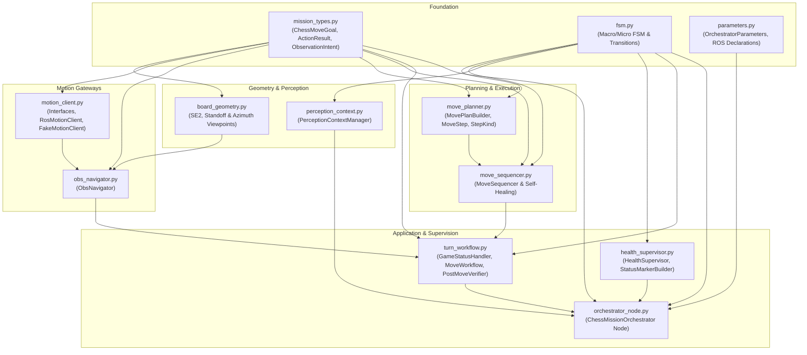

# `lekiwi_orchestrator`

High-level autonomous chess mission orchestrator, readiness-gated navigation startup, and camera operational mode state machine for LeKiwi mobile manipulation robot.

---

## 🏛️ Architecture & Clean Code Design (GoF & SOLID)

`lekiwi_orchestrator` is structured as a completely flattened, high-cohesion ROS 2 package adhering strictly to Clean Code, SOLID principles, and ensuring **all modules remain strictly below 1000 lines of code**:



### Dependency Rules & Layer Invariants
1. **Foundation (`mission_types.py`, `fsm.py`, `parameters.py`)**: Pure contracts, zero dependencies on higher-level packages.
2. **`board_geometry.py`**: Pure SE(2) mathematics, standoff calculation, azimuth viewpoint ranking, and TF board-to-map transformations with error logging.
3. **`motion_client.py` & `obs_navigator.py`**: Motion interfaces (`MotionClient`, `FeasibilityClient`, `NavigationClient`, `ManipulationClient`) and concrete clients (`RosMotionClient`, `FakeMotionClient`, `ObsNavigator`).
4. **`perception_context.py`**: Hardware-aware vision gating for GStreamer valves, Hailo-8 NPU, and LeRobot wrist cameras (`PerceptionContextManager`).
5. **`move_planner.py` & `move_sequencer.py`**: Execution step plan builder (`MovePlanBuilder`, `MoveStep`, `StepKind`), sequential execution sequencer (`MoveSequencer`), and fast-path/monotonic-watchdog self-healing.
6. **`health_supervisor.py`**: Node health supervision (`HealthSupervisor`), timer leak prevention, and RViz HUD markers (`StatusMarkerBuilder`).
7. **`turn_workflow.py` & `orchestrator_node.py`**: Application composition, orchestrator node (`ChessMissionOrchestrator`), turn workflow coordination (`MoveWorkflow`), referee telemetry (`GameStatusHandler`), and active post-move verification (`PostMoveVerifier`).

---

## 📦 Package Modules

| Module | Key Components | Responsibility |
|---|---|---|
| `mission_types.py` | `ActionResult`, `ObservationIntent`, `ChessMoveGoal` | Pure data transfer models and execution contracts. |
| `fsm.py` | `MacroMissionState`, `MotionExecutionState`, transitions | 2-level hierarchical FSM state definitions and transition validity matrix. |
| `parameters.py` | `OrchestratorParameters` | Parameter declarations and config models for chess orchestrator. |
| `board_geometry.py` | `RankedViewpoint`, `compute_radial_entry_pose`, TF transforms | Normalized SE(2) angle math, standoff pose validation, and azimuth ranking. |
| `motion_client.py` | `MotionClient`, `RosMotionClient`, `FakeMotionClient` | ROS 2 Nav2 & LeRobot action clients, simulated execution doubles, and action watchdogs. |
| `obs_navigator.py` | `ObsNavigator` | Autonomous active observation repositioning and viewpoint selection. |
| `perception_context.py` | `PerceptionContextManager` | Hardware-aware vision gating for GStreamer valves, Hailo-8 NPU, and wrist cameras. |
| `move_planner.py` | `MoveStep`, `MovePlanBuilder`, `StepKind` | Step generation (`CLEAR`, `PICK`, `PLACE`, `MOVE`). |
| `move_sequencer.py` | `MoveSequencer` | Multi-stage pipeline execution and fast-path grasp self-healing. |
| `health_supervisor.py` | `HealthSupervisor`, `StatusMarkerBuilder` | Heartbeat lease tracking, auto-recovery timer lifecycle, and RViz HUD markers. |
| `turn_workflow.py` | `MoveWorkflow`, `GameStatusHandler`, `PostMoveVerifier` | Game referee processing, full turn sequencing, and post-move verification. |
| `orchestrator_node.py` | `ChessMissionOrchestrator` | Top-level ROS 2 node, lifecycle integration, service handlers, and subsystem wiring. |

---

## 🧩 Nodes & Executables

| Executable | Class | Entrypoint | Purpose |
|---|---|---|---|
| `chess_mission_orchestrator` | `ChessMissionOrchestrator` | `lekiwi_orchestrator.orchestrator_node:main` | Autonomous mission manager, readiness gating, perception coordination, and self-healing. |

---

## 📡 Interfaces & Communication

### Subscriptions
- `/system/nav_ready` (`std_msgs/msg/Bool`): Base navigation readiness heartbeat from `lekiwi_motion`.
- `/system/grasp_ready` (`std_msgs/msg/Bool`): Arm manipulation precision readiness heartbeat from `lekiwi_motion`.
- `/chess/game_status` (`lekiwi_interfaces/msg/ChessGameStatus`): Match state, FIDE legality, and Stockfish `best_move`.

### Services & Actions
- `/workspace/check_move_feasibility` (`lekiwi_interfaces/srv/CheckMoveFeasibility`): Kinematics reachability & standoff pose query.
- `/orchestrator/recover` (`std_srvs/srv/Trigger`): Manual self-healing recovery service resetting `ERROR_FALLBACK`.
- `/orchestrator/set_perception_context` (`lekiwi_interfaces/srv/SetPerceptionContext`): Programmatic override of perception context.
- `/navigate_to_pose` (`nav2_msgs/action/NavigateToPose`): Nav2 standoff docking via ActionDispatcher.
- `/manipulation/execute_chess_move` (`lekiwi_interfaces/action/ExecuteChessMove`): Arm pick and place execution via ActionDispatcher.

### Publications
- `/perception_context` (`lekiwi_interfaces/msg/PerceptionContext`): Latched hardware-aware perception operational mode.
- `/diagnostics` (`diagnostic_msgs/msg/DiagnosticArray`): Telemetry on mission state, Nav & Grasp readiness, and recovery attempts.
- `~/status_markers` (`visualization_msgs/msg/MarkerArray`): 3D HUD billboard and mission status text in RViz.

---

## 🚀 Launch & Usage

The orchestration and readiness subsystem launch files and YAML configurations are centralized in `lekiwi_bringup`:

```bash
# Launch full orchestration layer from lekiwi_bringup
ros2 launch lekiwi_bringup orchestrator.launch.py

# Launch with autonomous mission execution enabled
ros2 launch lekiwi_bringup orchestrator.launch.py start_mission:=true
```

---

## 🧪 Testing & Architectural Verification

`lekiwi_orchestrator` features extensive unit testing and strict architectural contract assertions:

```bash
# Run architectural contract tests (verifies flat package, acyclic DAG, and line limits < 1000 lines)
pytest lekiwi_orchestrator/test/test_architecture_contracts.py -v

# Run all colcon pytest suites
colcon test --packages-select lekiwi_orchestrator --event-handlers console_cohesion+
colcon test-result --verbose
```
