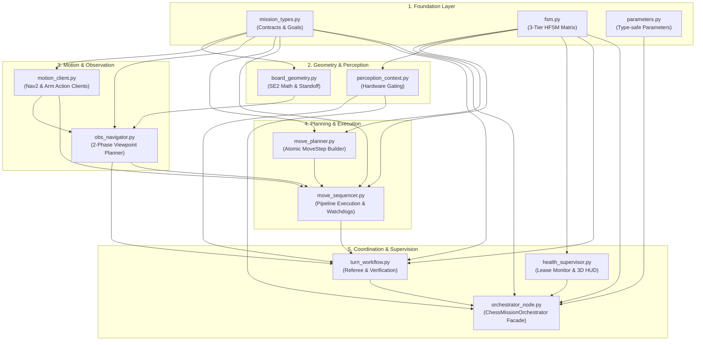

## Overview

The `lekiwi_orchestrator` package serves as the central mission coordinator and
subsystem mediator for the LeKiwi Autonomous Chess Playing Robot. It orchestrates
FIDE game referee signals, localization gating, camera perception contexts,
active observation repositioning, and coordinated mobile manipulation.

The package implements the **Mediator** and **Facade** design patterns within a
strictly decoupled, acyclic, and high-cohesion architecture. All 12 domain
modules are maintained strictly below 1,000 lines of code, adhering to Clean
Code, SOLID principles, and ROS 2 asynchronous execution standards.

---

## System Architecture and Design Patterns

`ChessMissionOrchestrator` coordinates six specialized domain subsystems via
dependency injection without exposing internal module complexity:



### Concurrency and Thread-Safety Model

The orchestrator operates within a `MultiThreadedExecutor` with rigorous
thread-safety guarantees:

- **State Synchronization (`_state_lock`)**: All macro FSM transitions,
  move goal caches, and recovery checkpoints are guarded by a reentrant mutex
  (`threading.RLock`).
- **Callback Group Partitioning**:
  - `_cb_group_sub` (`MutuallyExclusiveCallbackGroup`): Serializes fast topic
    callbacks (`/system/nav_ready`, `/system/grasp_ready`, `/chess/game_status`).
  - `_cb_group_client` (`ReentrantCallbackGroup`): Drives asynchronous action
    clients and service invocations concurrently, eliminating deadlock during
    nested ROS 2 calls.
- **Open Call Pattern**: State transitions release `_state_lock` before
  invoking long-running side effects (such as `_move_sequencer.cancel()` or
  recovery timer scheduling) to prevent lock contention with active ROS 2
  action feedback threads.

---

## Hierarchical Finite State Machine (HFSM)

The mission lifecycle is structured into a 3-tier hierarchical state machine
coupled with hardware-aware camera perception gating:

```text
+-------------------------------------------------------------------------+
| Level 1: Macro Mission States (fsm.py)                                  |
|                                                                         |
|  [BOOT_INITIALIZING] --> [WAITING_FOR_TF_READY]                         |
|                                |                                        |
|                                v                                        |
|  +-------------------> [WAITING_FOR_PLAYER_MOVE]                        |
|  |                             |                                        |
|  |                             v                                        |
|  |                     [EVALUATING_BEST_MOVE]                           |
|  |                             |                                        |
|  |                             v                                        |
|  |                     [EXECUTING_MOVE]                                 |
|  |                             |                                        |
|  |                             v                                        |
|  |                     [POST_MOVE_VERIFYING]                            |
|  |                             |                                        |
|  +---------------------+-------+                                        |
|  |                     |                                                |
|  v                     v                                                |
| [TURN_COMPLETED]   [GAME_OVER]          [ERROR_FALLBACK]                |
|                                         (Auto-Recovery Escalation)      |
+-------------------------------------------------------------------------+
| Level 2: Motion Execution States (move_sequencer.py)                    |
|  - IDLE -> NAVIGATING_TO_STANDOFF -> MANIPULATING -> FAILED             |
+-------------------------------------------------------------------------+
| Level 3: Micro Move Steps (move_planner.py)                             |
|  - APPROACH -> CLEAR (Captured Piece) -> PICK -> PLACE -> RETREAT       |
+-------------------------------------------------------------------------+
| Perception Context Gating (perception_context.py)                       |
|  - Mode 1: TF_TRACKING_AND_NAV (Visual SLAM & Tag Tracking)             |
|  - Mode 2: BOARD_STATE_SCAN (Overhead Board FEN Digitization)           |
|  - Mode 3: WRIST_SERVO_ACTIVE (Gripper Close-Up Visual Servoing)        |
+-------------------------------------------------------------------------+
```

---

## Active Observation Repositioning Strategy

When visual occlusions or board state ambiguities occur, `ObsNavigator` executes
a **2-Phase Repositioning Strategy** along the circular standoff boundary
($S^1$):

1. **Phase 1: Radial Standoff Guard**:
   - Evaluates whether current planar base coordinates $(x, y)$ satisfy
     $| \sqrt{x^2 + y^2} - R | \le \Delta R$ ($R = 0.65\text{ m}, \Delta R = 0.04\text{ m}$).
   - If outside tolerance, dispatches a radial entry waypoint orienting the
     mobile base inward toward the chessboard center.
2. **Phase 2: Azimuth Cost Navigation**:
   - Computes geodesic angular distances along the circle from candidate offsets
     ($\Delta \theta \in [0^\circ, \pm 18^\circ]$ for relocalization;
     $\Delta \theta \in [0^\circ, \pm 18^\circ, \pm 32^\circ]$ for post-move
     verification).
   - Ranks viewpoints by minimal transit arc cost and commands Nav2 to dock at
     the nearest vantage point.

---

## Subsystem Modules

| Module | Primary Classes | Architectural Responsibility |
| :--- | :--- | :--- |
| `mission_types.py` | `ChessMoveGoal`, `ActionResult`, `ObservationIntent` | Immutable data contracts, factory parsers, and execution results. |
| `fsm.py` | `MacroMissionState`, `MotionExecutionState`, transitions | 3-tier state enums, state validation matrix, and illegal transition guards. |
| `parameters.py` | `OrchestratorParameters` | Node parameter declaration, strict validation, and cached configuration. |
| `board_geometry.py` | `RankedViewpoint`, `compute_radial_entry_pose` | Planar SE(2) mathematics, standoff projection, and azimuth ranking. |
| `perception_context.py` | `PerceptionContextManager` | GStreamer valve & Hailo-8 camera operational context switching. |
| `motion_client.py` | `RosMotionClient`, `MotionClient` | Nav2 & arm manipulation action clients with watchdog timeouts. |
| `obs_navigator.py` | `ObsNavigator` | Autonomous multi-viewpoint active observation repositioning. |
| `move_planner.py` | `MovePlanBuilder`, `MoveStep`, `StepKind` | Kinematic stage generation (`CLEAR`, `PICK`, `PLACE`, `MOVE`). |
| `move_sequencer.py` | `MoveSequencer` | Sequential stage advancement, watchdog enforcement, and grasp self-healing. |
| `health_supervisor.py` | `HealthSupervisor`, `StatusMarkerBuilder` | Readiness heartbeat lease tracking, auto-recovery timers, and 3D HUD. |
| `turn_workflow.py` | `GameStatusHandler`, `MoveWorkflow`, `PostMoveVerifier` | Referee processing, turn lifecycle orchestration, and verification. |
| `orchestrator_node.py` | `ChessMissionOrchestrator` | Top-level node facade, dependency wiring, and ROS 2 lifecycle coordination. |

---

## ROS 2 Interfaces

### Subscribed Topics

| Topic | Message Type | QoS | Semantic Purpose |
| :--- | :--- | :--- | :--- |
| `/system/nav_ready` | `std_msgs/msg/Bool` | Transient Local, Depth 1 | Navigation readiness heartbeat lease from `lekiwi_navigation`. |
| `/system/grasp_ready` | `std_msgs/msg/Bool` | Transient Local, Depth 1 | Arm IK and visual grasp readiness lease from `lekiwi_arm_plan`. |
| `/chess/game_status` | `lekiwi_interfaces/msg/ChessGameStatus` | Volatile, Depth 10 | Referee match status, active turn, checkmate flags, and best move. |

### Published Topics

| Topic | Message Type | QoS | Semantic Purpose |
| :--- | :--- | :--- | :--- |
| `/perception_context` | `lekiwi_interfaces/msg/PerceptionContext` | Transient Local, Depth 1 | Active vision pipeline mode (gating GStreamer / Hailo-8 streams). |
| `/diagnostics` | `diagnostic_msgs/msg/DiagnosticArray` | Volatile, Depth 10 | Node health telemetry, readiness status, and recovery metrics. |
| `~/status_markers` | `visualization_msgs/msg/MarkerArray` | Volatile, Depth 10 | RViz 3D text HUD billboard anchored above `base_footprint`. |

### Services and Actions

| Name | Interface Type | Role | Purpose |
| :--- | :--- | :--- | :--- |
| `/workspace/check_move_feasibility` | `lekiwi_interfaces/srv/CheckMoveFeasibility` | Client | Queries workspace reachability and IK feasibility before motion. |
| `/orchestrator/recover` | `std_srvs/srv/Trigger` | Server | Manual recovery endpoint to clear `ERROR_FALLBACK` state. |
| `/orchestrator/set_perception_context` | `lekiwi_interfaces/srv/SetPerceptionContext` | Server | Programmatic override of active perception operational context. |
| `/navigate_to_pose` | `nav2_msgs/action/NavigateToPose` | Client | Dispatches radial entry or azimuth repositioning goals to Nav2. |
| `/manipulation/execute_chess_move` | `lekiwi_interfaces/action/ExecuteChessMove` | Client | Dispatches trajectory and gripper goals to arm manipulation server. |

---

## Node Parameters

Parameters can be overridden via YAML configuration files or launch arguments:

| Parameter | Type | Default | Unit / Description |
| :--- | :--- | :--- | :--- |
| `robot_color` | `string` | `"b"` | Robot player color (`"w"` for White, `"b"` for Black). |
| `board_frame` | `string` | `"chessboard_frame"` | Coordinate frame ID of the chessboard origin. |
| `map_frame` | `string` | `"map"` | Global map coordinate frame ID. |
| `navigation` | `bool` | `true` | Enables real Nav2 action dispatching (false activates mock). |
| `feasibility_timeout_sec` | `double` | `5.0` | Timeout in seconds for reachability service response. |
| `action_timeout_sec` | `double` | `60.0` | Watchdog timeout for Nav2 and manipulation action completion. |
| `readiness_timeout_sec` | `double` | `1.0` | Heartbeat expiration threshold for navigation and grasp readiness. |
| `pre_grasp_settle_sec` | `double` | `2.0` | Stabilization pause duration between base docking and arm pick. |
| `recovery.auto_recovery_enabled` | `bool` | `true` | Enables automatic recovery retry timer upon `ERROR_FALLBACK`. |
| `recovery.auto_recovery_timeout_sec` | `double` | `5.0` | Delay before triggering auto-recovery transition. |
| `recovery.max_recovery_attempts` | `int` | `3` | Maximum consecutive self-healing attempts before lockout. |
| `observation.standoff_distance` | `double` | `0.65` | Target radial observation distance $R$ from board center (meters). |
| `observation.radius_tolerance` | `double` | `0.04` | Permissible radial tolerance band $\Delta R$ on standoff circle (meters). |
| `observation.scan_timeout_sec` | `double` | `6.0` | Timeout allowed for overhead board FEN confirmation. |
| `observation.angle_offsets.relocalize` | `double[]` | `[0.0, -0.314, 0.314]` | Candidate azimuth offsets (rad) for visual relocalization. |
| `observation.angle_offsets.post_move_verify` | `double[]` | `[0.0, -0.314, 0.314, -0.558, 0.558]` | Candidate azimuth offsets (rad) for post-move verification. |
| `visualization.enabled` | `bool` | `true` | Enables RViz 3D status HUD billboard marker publishing. |
| `visualization.topic` | `string` | `"~/status_markers"` | Topic name for visualization markers. |
| `visualization.hud_z_offset` | `double` | `0.35` | Height offset (meters) of HUD billboard above `robot_frame`. |
| `visualization.robot_frame` | `string` | `"base_footprint"` | Reference frame for status HUD anchoring. |

---

## Fault Tolerance and Self-Healing

The orchestrator incorporates automated self-healing mechanisms:

1. **TF Readiness Heartbeat Guard**: If TF tracking drops or `/system/nav_ready`
   times out (> 1.0 s), the orchestrator immediately transitions to
   `ERROR_FALLBACK` to halt mechanical motion.
2. **Pending Move Preservation**: When transitioning into `ERROR_FALLBACK`, any
   unfulfilled chess move is preserved in `_pending_recovery_move`. Once Nav2
   readiness is re-confirmed, the orchestrator automatically resumes the pending
   move without human intervention.
3. **Escalated Auto-Recovery**: An asynchronous recovery timer triggers up to
   `max_recovery_attempts` (3 cycles). Recovery resets action goals, clears
   pipeline sequencers, sets perception to `TF_TRACKING_AND_NAV`, and returns to
   `WAITING_FOR_TF_READY`.

---

## Build, Testing, and Execution

### Build Package

```bash
cd ~/docker_ws
colcon build --packages-select lekiwi_orchestrator --symlink-install
```

### Architectural and Unit Verification

```bash
# Run strict architectural contract tests (verifies flat package & line counts < 1000)
pytest lekiwi_ros2/lekiwi_orchestrator/test/test_architecture_contracts.py -v

# Run entire test suite via colcon
colcon test --packages-select lekiwi_orchestrator --event-handlers console_cohesion+
colcon test-result --verbose
```

### Launch Subsystem

The orchestration layer is launched via `lekiwi_bringup`:

```bash
# Launch orchestrator node with default parameters
ros2 launch lekiwi_bringup orchestrator.launch.py

# Launch with autonomous mission execution enabled for White player
ros2 launch lekiwi_bringup orchestrator.launch.py robot_color:=w start_mission:=true
```
