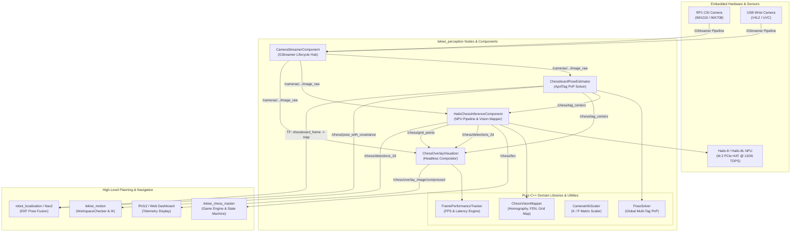

## Overview

The `lekiwi_perception` package serves as the primary visual perception and spatial intelligence subsystem for the **LeKiwi** mobile manipulator robot. Operating across high-resolution CSI and USB camera pipelines, embedded hardware neural network accelerators (Hailo-8 / Hailo-8L M.2 NPU), and multi-tag fiducial localization algorithms, `lekiwi_perception` provides low-latency, real-time board state extraction, 6-DoF robot-to-board pose estimation, and diagnostic visual streaming.

### Key Capabilities

- **Lifecycle-Managed GStreamer Video Hub (`CameraStreamerComponent`)**: Zero-copy camera acquisition supporting Raspberry Pi 5 RP1 CSI cameras (`libcamerasrc`) and USB cameras (`v4l2src`). Includes dynamic GStreamer `valve` gating for zero-CPU source frame dropping during idle contexts.
- **Hailo-8/8L NPU Neural Inference Engine (`HailoChessInferenceComponent`)**: Hardware-accelerated execution of YOLO models (`yolo11n.hef`, `yolov8n-seg.hef`) via HailoRT and TAPPAS post-processing modules (`lekiwi_pieces_postprocess`, `lekiwi_chessboard_postprocess`).
- **Spatial Board State Extraction (`ChessVisionMapper`)**: Translates 2D piece bounding boxes and 81 grid intersections into Forsyth-Edwards Notation (FEN) strings, resolving orientation ambiguity via corner AprilTag anchors.
- **High-Precision Multi-Tag 6-DoF Pose Solver (`ChessboardPoseEstimator`)**: Global Perspective-n-Point (PnP) solver fusing multiple board-mounted AprilTags (tag family 16h5) to compute robot base pose relative to the board frame with dynamic motion covariance modeling.
- **Resource-Aware Perception Visualizer (`ChessOverlayVisualizer`)**: Headless composite video overlay rendering bounding boxes, grid lines, and status badges with zero-overhead lazy evaluation and TTL staleness gating.

---

## Architecture

`lekiwi_perception` is designed around the ROS 2 Component architecture (`rclcpp_components`), allowing all visual processing nodes to run inside a single shared memory process space (eliminating image copy serialization overhead) or as standalone lifecycle executables.



---

## Core Concepts & Technical Specifications

### 1. Dynamic Valve Gating & Zero-Copy Pipeline

Processing high-resolution video (e.g., $3280 \times 2464$ at 30 FPS) consumes significant CPU and bus bandwidth. `CameraStreamerComponent` implements dynamic GStreamer `valve` gating:

```
[Camera Source (libcamerasrc / v4l2src)]
                  |
                  v
       +--------------------+
       |  GStreamer valve   | <--- /perception_context
       |  (drop=true/false) |      (Autonomous Mode Switch)
       +--------------------+
                  | (Frames dropped with 0 CPU overhead when closed)
                  v
       [Videoconvert & Scaler]
                  |
                  v
           [appsink (ROS 2)]
```

- When the robot is in a context where perception is unneeded (e.g., long-distance transit), the valve element sets `drop=true`. Frames are discarded inside the kernel/GStreamer pipeline before memory allocation or color conversion.
- Upon receiving a relevant context ID via `/perception_context` (e.g., `CONTEXT_BOARD_SEARCH` or `CONTEXT_CHESS_EVALUATION`), the valve opens instantaneously with $< 1\ \text{ms}$ latency.

### 2. Multi-Tag Global PnP Board Pose Estimation (`PoseSolver`)

To eliminate ambiguity and perspective distortion when viewing a planar chessboard from an inclined camera pose ($\approx 47^\circ$ tilt), `ChessboardPoseEstimator` uses a global multi-tag PnP solver:

- The chessboard perimeter is equipped with 4 corner AprilTags (family `16h5`):
  - **Tag 0 (A1)**: Bottom-Left $(x_0, y_0, 0)$
  - **Tag 1 (H1)**: Bottom-Right $(x_1, y_1, 0)$
  - **Tag 2 (H8)**: Top-Right $(x_2, y_2, 0)$
  - **Tag 3 (A8)**: Top-Left $(x_3, y_3, 0)$
- Rather than estimating pose from isolated tags, `PoseSolver::estimate_board_pose` stacks the 3D corner coordinates of all detected tags into a single world matrix $\mathbf{P}_w \in \mathbb{R}^{4N \times 3}$ and corresponding 2D image detections $\mathbf{p}_i \in \mathbb{R}^{4N \times 2}$ ($N \ge 2$ tags):
  $$\min_{\mathbf{R}, \mathbf{t}} \sum_{j=1}^{4N} \left\| \mathbf{p}_j - \pi\left(\mathbf{K}, \mathbf{R} \mathbf{P}_{w,j} + \mathbf{t}\right) \right\|^2$$
- Solved using Levenberg-Marquardt optimization (`cv::SOLVEPNP_ITERATIVE`) with previous extrinsic tracking as an initial guess (`use_extrinsic_guess = true`), yielding stable sub-millimeter translation and $< 0.2^\circ$ orientation accuracy.

### 3. Dynamic Motion Covariance Modeling

Visual pose updates sent to `robot_localization` must reflect measurement uncertainty during base movement. `compute_covariance()` dynamically scales positional variance $\sigma_p^2$ and rotational variance $\sigma_r^2$:

$$\sigma_p^2 = \sigma_{p,0}^2 \cdot \left(1 + \alpha_v |v| + \alpha_\omega |\omega_z|\right) \cdot \frac{K_{\text{tags}}}{N_{\text{used}}}$$

- **Stationary base with 4 tags visible**: Base variance $\sigma_p^2 \approx 0.0001\ \text{m}^2$ (high trust).
- **Moving base ($v > 0.1\ \text{m/s}$) with 2 tags visible**: Scaled variance $\sigma_p^2 > 0.01\ \text{m}^2$ (low trust, preventing EKF filter disruption from motion blur).

### 4. Hailo NPU Inference & Spatial Vision Mapping (`ChessVisionMapper`)

```
   Raw Camera Frame (RGB8)
              |
              v
   +---------------------------------------------+
   | Hailo-8 NPU Hardware Acceleration           |
   | - YOLOv11 / YOLOv8 Detection & Segmentation |
   +---------------------------------------------+
              |
              v
     ROI Tensors & Bounding Boxes
              |
              v
   +---------------------------------------------+
   | ChessVisionMapper (Spatial Projection)      |
   | 1. Compute 3x3 Homography Matrix (H)        |
   | 2. Re-project Ground Contact (Base Point)   |
   | 3. Match AprilTag A1 Corner Orientation     |
   | 4. Map Bounding Boxes -> Squares (a1..h8)   |
   | 5. Generate Full Forsyth-Edwards (FEN)      |
   +---------------------------------------------+
              |
              +---> /chess/fen ("rnbqkbnr/pppppppp/...")
              +---> /chess/detections_2d (Bounding Boxes)
              +---> /chess/grid_points (81 Intersections)
```

- **Ground Contact Heuristic**: Because pieces have height, projecting bounding box centers induces parallax error. The mapper computes the piece base point at $y_{\text{base}} = y_{\text{min}} + 0.88 \cdot h$, accurately pinning the piece to the board plane under perspective tilt.
- **FEN Construction**: Aggregates occupancy into an $8 \times 8$ matrix, collapsing consecutive empty squares into standard FIDE numerical counts (e.g., `8`, `4P3`).

### 5. Zero-Overhead Overlay Visualization (`ChessOverlayVisualizer`)

- **Lazy Evaluation**: The node queries `overlay_pub_->get_subscription_count()`. If no dashboard or RViz instance is subscribed to `/chess/overlay_image/compressed`, the visualizer immediately returns, skipping image decompression, OpenCV drawing routines, and JPEG re-encoding.
- **TTL Staleness Gating**: Tag centers and piece detections are timestamped. If detection data is older than `stale_timeout_sec` ($0.5\ \text{s}$), drawing is suppressed to prevent visual ghosting during network drops or tracking losses.

---

## Quick Start & Usage

### 1. Build the Package

Compile `lekiwi_perception` in your ROS 2 workspace:

```bash
cd /root/docker_ws
colcon build --packages-select lekiwi_perception --symlink-install --cmake-args -DCMAKE_BUILD_TYPE=Release
source install/setup.bash
```

### 2. Standalone Node Execution

Run components individually for calibration or testing:

```bash
# Terminal 1: Camera Streamer (using stereo left calibration config)
ros2 run lekiwi_perception camera_streamer_node --ros-args \
  --params-file /root/docker_ws/lekiwi_ros2/lekiwi_perception/config/calibration/stereo_left_conf.yaml

# Terminal 2: Chessboard Pose Estimator
ros2 run lekiwi_perception chessboard_pose_estimator_node

# Terminal 3: Visual Overlay Renderer
ros2 run lekiwi_perception chess_overlay_visualizer_node
```

### 3. Transition Lifecycle States via CLI

`CameraStreamerComponent`, `HailoChessInferenceComponent`, and `ChessboardPoseEstimator` are managed ROS 2 lifecycle nodes:

```bash
# Configure the camera streamer
ros2 lifecycle set /camera_streamer_node configure

# Activate streaming
ros2 lifecycle set /camera_streamer_node activate

# Deactivate streaming
ros2 lifecycle set /camera_streamer_node deactivate
```

### 4. Switch Perception Context via Service

Control active hardware pipelines dynamically:

```bash
ros2 service call /hailo_chess_inference/set_perception_context \
  lekiwi_interfaces/srv/SetPerceptionContext "{context_id: 1}"
```

### 5. Camera Calibration Stream Mode

To calibrate cameras using the standard ROS 2 camera calibration tool (`ros-humble-camera-calibration`):

```bash
# Launch camera in calibration mode (5 FPS full resolution, unbinned)
ros2 run lekiwi_perception camera_streamer_node --ros-args \
  --params-file /root/docker_ws/lekiwi_ros2/lekiwi_perception/config/calibration/stereo_left_conf.yaml \
  -p calib_mode:=true

# Run calibration tool
ros2 run camera_calibration cameracalibrator --size 8x6 --square 0.03 \
  image:=/stereo_left/image_raw camera:=/stereo_left
```

---

## ROS 2 Interface Specifications

### 1. Published Topics

| Topic Name | Message Type | Quality of Service (QoS) | Source Component | Description |
| :--- | :--- | :--- | :--- | :--- |
| `<camera_name>/image_raw` | `sensor_msgs/msg/Image` | Sensor Data / System Default | `CameraStreamerComponent` | Uncompressed video stream in RGB8 / BGR8 format. |
| `<camera_name>/image_raw/compressed` | `sensor_msgs/msg/CompressedImage` | Sensor Data | `CameraStreamerComponent` | JPEG-compressed video stream. |
| `<camera_name>/camera_info` | `sensor_msgs/msg/CameraInfo` | System Default, Reliable | `CameraStreamerComponent` | Camera intrinsic matrix $K$, distortion $D$, and projection $P$. |
| `/chess/fen` | `std_msgs/msg/String` | System Default, Reliable | `HailoChessInferenceComponent` | Live chess board state represented in Forsyth-Edwards Notation. |
| `/chess/detections_2d` | `vision_msgs/msg/Detection2DArray` | Sensor Data, Best Effort | `HailoChessInferenceComponent` | Bounding boxes, class names, and confidence scores for pieces. |
| `/chess/tag_centers` | `geometry_msgs/msg/PolygonStamped` | System Default, Reliable | `ChessboardPoseEstimator` | Normalized 2D coordinates of detected AprilTag centers. |
| `/chess/grid_points` | `geometry_msgs/msg/PolygonStamped` | System Default, Reliable | `HailoChessInferenceComponent` | 81 projected board square corner intersections. |
| `/chess/pose_with_covariance` | `geometry_msgs/msg/PoseWithCovarianceStamped` | Sensor Data / Reliable | `ChessboardPoseEstimator` | 6-DoF robot pose in map frame with speed-scaled covariance. |
| `/chess/overlay_image/compressed` | `sensor_msgs/msg/CompressedImage` | Sensor Data, Best Effort | `ChessOverlayVisualizer` | Real-time annotated diagnostic video feed. |

### 2. Subscribed Topics

| Topic Name | Message Type | QoS | Target Component | Purpose |
| :--- | :--- | :--- | :--- | :--- |
| `/perception_context` | `lekiwi_interfaces/msg/PerceptionContext` | Transient Local, Reliable | All Lifecycle Components | Triggers dynamic valve gating and algorithm power modes. |
| `/cameras/stereo_left/image_raw` | `sensor_msgs/msg/Image` | Sensor Data | `HailoChessInferenceComponent`, `ChessboardPoseEstimator`, `ChessOverlayVisualizer` | Primary input image stream for vision algorithms. |
| `/odometry/filtered` | `nav_msgs/msg/Odometry` | System Default | `ChessboardPoseEstimator` | Robot velocities used for dynamic PnP covariance scaling. |
| `/chess/detections_2d` | `vision_msgs/msg/Detection2DArray` | Sensor Data | `ChessOverlayVisualizer` | Piece bounding boxes for diagnostic overlay rendering. |
| `/chess/tag_centers` | `geometry_msgs/msg/PolygonStamped` | System Default | `HailoChessInferenceComponent`, `ChessOverlayVisualizer` | AprilTag positions for board orientation and visual tags. |
| `/chess/grid_points` | `geometry_msgs/msg/PolygonStamped` | System Default | `ChessOverlayVisualizer` | Chessboard grid intersections for visual alignment overlay. |

### 3. Services

| Service Name | Service Type | Server Component | Description |
| :--- | :--- | :--- | :--- |
| `/hailo_chess_inference/set_perception_context` | `lekiwi_interfaces/srv/SetPerceptionContext` | `HailoChessInferenceComponent` | Overrides or updates the active perception context state. |

---

## Configuration & Parameter Reference

### Camera Streamer Configuration (`camera_streamer_node`)

```yaml
camera_streamer:
  ros__parameters:
    camera_name: "stereo_left"
    frame_id: "stereo_left_optical"
    camera_info_url: "package://lekiwi_bringup/config/perception/camera_info/stereo_left.yaml"
    image_encoding: "rgb8"
    use_sensor_data_qos: true
    sync_sink: false
    use_gst_timestamps: true
    autostart: true
    calib_mode: false
    active_contexts: [1, 2, 4]
    valve_name: "gate"
    output_size: 0               # 0 = keep native resolution; >0 = resize square
    add_border: false            # true = letterbox; false = crop
    gscam_config: >
      libcamerasrc camera-name="/base/axi/pcie@1000120000/rp1/i2c@80000/imx219@10" !
      queue leaky=downstream max-size-buffers=1 !
      video/x-raw,format=NV12,width=1640,height=1232,framerate=30/1 !
      videoflip method="rotate-180" !
      videoconvert n-threads=4 !
      video/x-raw,format=RGB
```

### Chessboard Pose Estimator Configuration (`chessboard_pose_estimator_node`)

```yaml
chessboard_pose_estimator:
  ros__parameters:
    autostart: true
    tag_family: "16h5"
    tag_size: 0.029              # AprilTag outer dimension in meters
    detection_rate_hz: 5.0       # Processing rate cap to throttle CPU
    min_tags_cnt: 2              # Minimum visible tags required for PnP solution
    map_frame: "map"
    odom_frame: "odom"
    chessboard_frame: "chessboard_frame"
    camera_frame: "stereo_left_optical"
    base_frame: "base_footprint"
    publish_static_tf: true
    chessboard_pose_in_map: [0.0, 0.0, 0.004, 0.0, 0.0, 0.0]
```

### Visual Overlay Configuration (`chess_overlay_visualizer_node`)

```yaml
chess_overlay_visualizer:
  ros__parameters:
    camera_topic: "/cameras/stereo_left/image_raw"
    overlay_topic: "/chess/overlay_image/compressed"
    jpeg_quality: 80
    stale_timeout_sec: 0.5       # Discard detection markers older than 500 ms
    debug: true                  # Render FPS and latency badge overlay
```

---

## Troubleshooting & Diagnostics

| Symptom | Probable Root Cause | Resolution & Verification |
| :--- | :--- | :--- |
| `CameraStreamerComponent` fails on `configure` with `GStreamer pipeline construction error` | Invalid device node, missing GStreamer plugin (`gstreamer1.0-plugins-bad`), or conflicting pipeline syntax. | Verify GStreamer pipeline manually via `gst-launch-1.0`. Ensure camera hardware is accessible using `v4l2-ctl --list-devices` or `rpicam-hello --list-cameras`. |
| Zero frames published; node diagnostics show `Valve Closed` | Incoming `/perception_context` does not match any entry in `active_contexts`. | Inspect active context via `ros2 topic echo /perception_context`. Call `/hailo_chess_inference/set_perception_context` or set `active_contexts: []` to disable gating. |
| Hailo inference fails with `Driver/Device Not Found` | Hailo PCIe driver or firmware not loaded (`/dev/hailo0` absent). | Verify Hailo driver status via `hailortcli scan` and `dmesg \| grep hailo`. Ensure PCIe HAT connection is secure. |
| FEN string reports inverted board orientation (White pieces on Rank 8) | AprilTag corner matching failed to detect Tag 0 (A1) or tag IDs are misconfigured. | Verify camera view captures at least Tag 0 (A1). Check `/chess/tag_centers` using `ros2 topic echo` and ensure tag IDs match physical placement. |
| Pose estimator publishes jumpy or divergent poses | Lens distortion coefficients incorrect or tag size parameter mismatch. | Run camera calibration using `cameracalibrator` to regenerate `camera_info.yaml`. Ensure `tag_size` matches the physical printed marker size. |
| High CPU usage in `ChessOverlayVisualizer` | Compression quality set too high or unsubscribed streams continuing to render. | Verify lazy evaluation is operating. Reduce `jpeg_quality` to `60`-`75` or throttle camera framerate in `gscam_config`. |

---

## Verification & Unit Testing

`lekiwi_perception` includes a rigorous test suite built with GoogleTest (`ament_cmake_gtest`) that exercises algorithms with synthetic geometric data and mocked frames without requiring physical cameras or Hailo hardware:

```bash
# Run all perception unit tests
colcon test --packages-select lekiwi_perception --event-handlers console_direct+

# Inspect test results
colcon test-result --all --verbose
```

### Test Target Breakdown

- **`test_camera_streamer_component`**: Validates lifecycle state transitions (`configure`, `activate`, `deactivate`), GStreamer pipeline instantiation, and valve open/close logic.
- **`test_pose_solver`**: Tests corner projection, multi-tag PnP convergence, and robustness against collinear or missing tags.
- **`test_chessboard_covariance`**: Verifies dynamic covariance scaling under varying linear speeds, angular velocities, and tag counts.
- **`test_chess_vision_mapper`**: Evaluates homography generation, FEN string formatting, and AprilTag orientation remapping across standard chess setups.
- **`test_perception_utils`**: Tests `CameraInfoScaler` intrinsic scaling mathematics (letterboxing vs cropping) and `FramePerformanceTracker` rolling average accuracy.
- **`test_chess_overlay_visualizer`**: Verifies lazy evaluation suppression when subscriber count is 0 and tests OpenCV text badge rendering.
- **`test_hailo_gst_pipeline`**: Tests GStreamer pipeline string syntax generators and Hailo app sink hooks.
